## Part 1: Collaboration problems and principles

---
layout: two-cols
---

# Software development is ongoing

- Software is never “finished”
- Bugs are discovered over time
- New requirements and improvements emerge

::right::

  

---
layout: two-cols
---

# Knowing about problems is not enough

- Issues must be recorded somewhere shared
- They need prioritisation and ownership
- Decisions need context and history

::right::

  

---
layout: two-cols
---

# What is issue tracking?

- A shared list of tasks, bugs, and ideas
- A place for discussion and decisions
- A record of what was done and why

::right::

  

---
layout: two-cols
---

# Parallel work and code review

- Multiple contributors working on the same codebase
- Working in parallel on separate changes
- Reviewing each other’s work before integration

::right::

::center

::

---
layout: section
title: " "
---

## Part 2: Platforms enable these practices

---

# From collaboration practices to tools

- Issue tracking is a practice
- Parallel work is a practice
- Code review is a practice

 
 

<v-click>

  <h3><b>Tools exist to support these practices at scale</b></h3>

</v-click>

---

# Project management with GitHub

- "GitHub Issues" are an implementation of issue tracking
- "Mentions" are a communication mechanism
- "Labels" and "milestones" are prioritisation tools

  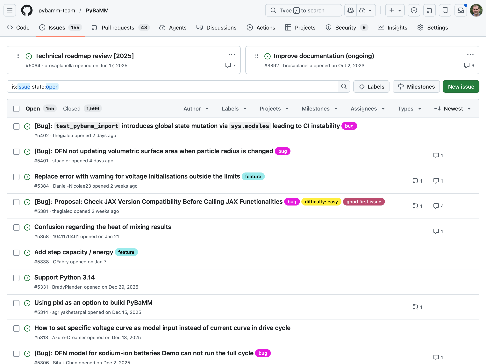
  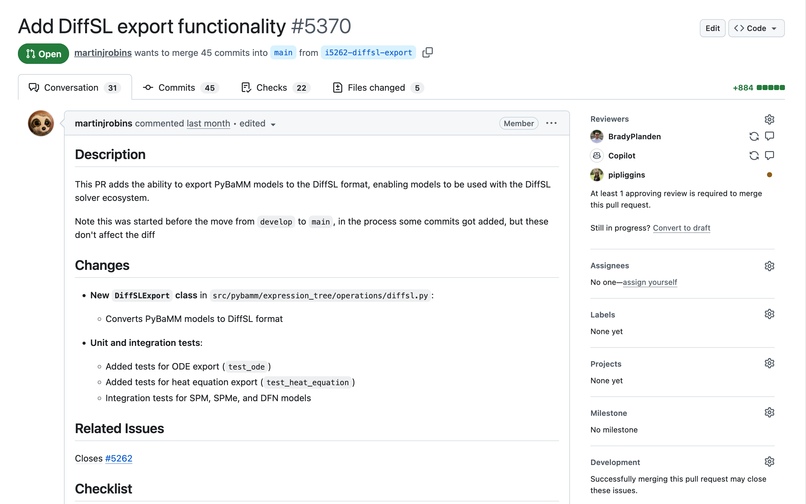

---

# Git branches + feature branch workflow

::center

**Git implements parallel work using branches**

 

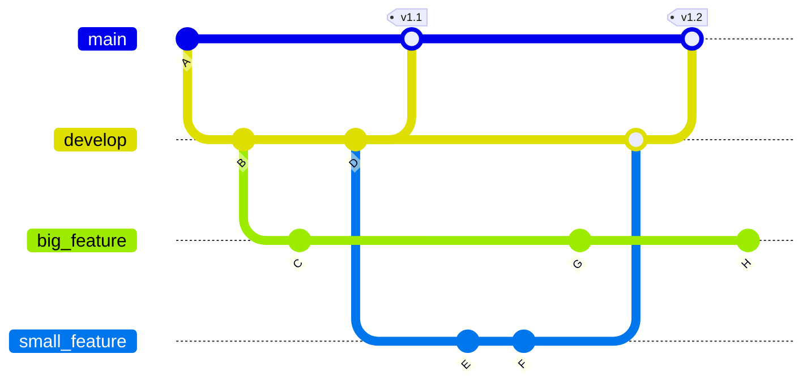

---

# Git branches + feature branch workflow

Commit to main branch
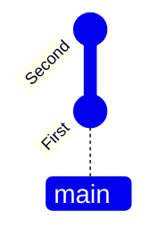

Create a new branch, make commits to it
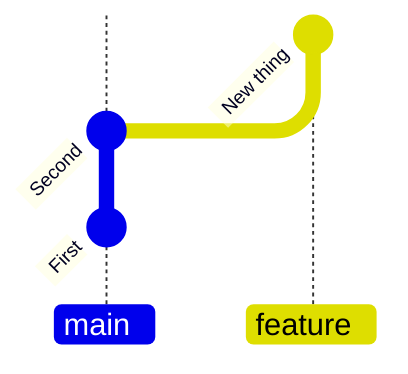

Changes independent of main branch
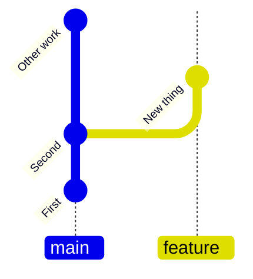

Merge commit
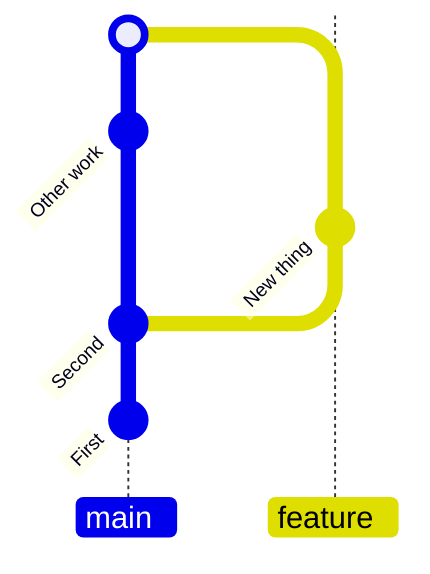

- Main branch for tested, stable code, feature branches for new, separate units of work
- Keeps main branch stable, allows independent work on features
- Easy to discard unwanted features

---

# Collaborative code development models

::center
<b>Different projects balance control and openness differently</b>
::

  

    
Shared repository model

    
(common in private projects)

    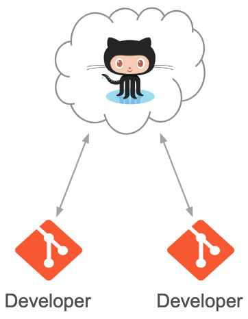
  

  <v-click >
    

      
Fork and pull model

      
(popular in open source)

      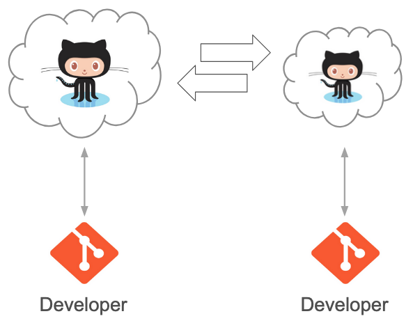
    

  </v-click>

---
layout: two-cols
---

# Pull requests: a tool for review and integration

- Propose changes for review
- Discuss and refine work
- Run automated checks on changes
- Integrate approved changes safely

::right::

::center
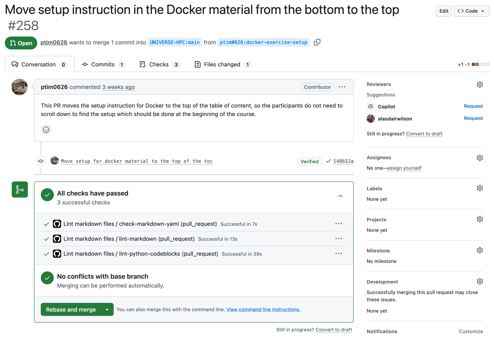
::

---
layout: two-cols
---

# Advantages of code review

- Identifies defects early in the process
- Cost-effective error removal
- Enhances team learning and collaboration
- Improves overall team software development process

::right::

::center
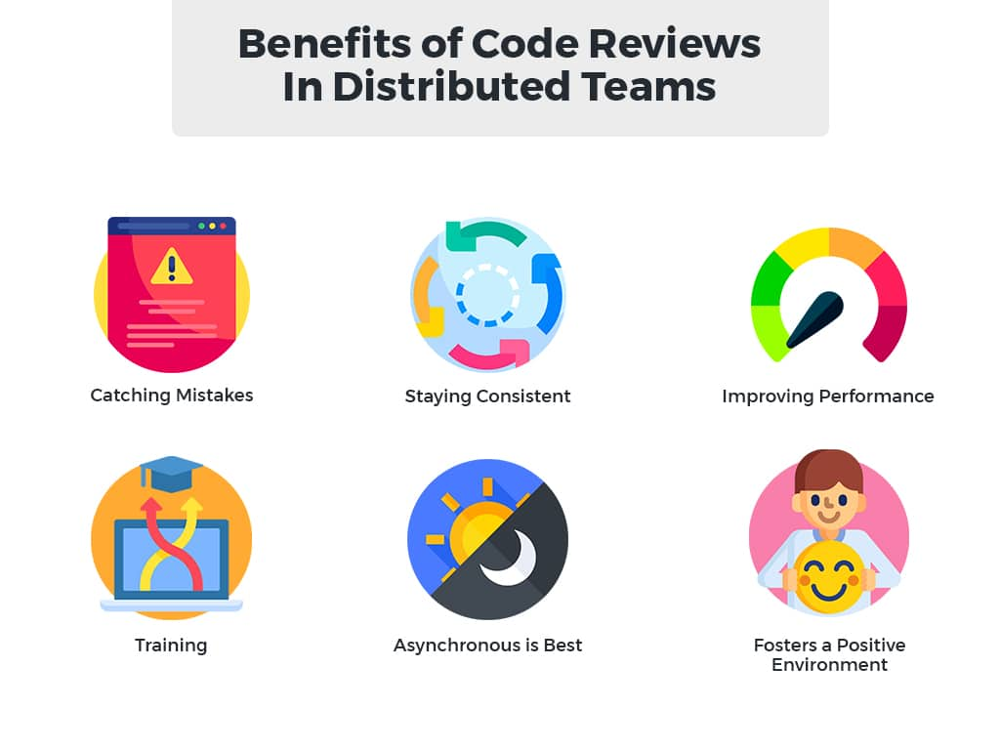
::

---

# Adding code via GitHub pull requests

- Discuss and review changes
- Add follow-up commits based on feedback
- Merge changes from feature branch to base branch

  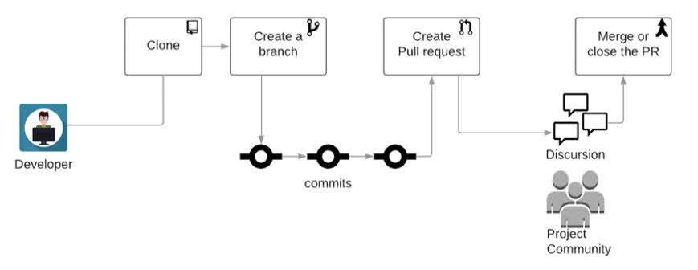

---

# Learning objectives

- Use the feature branch workflow to collaborate with others on the same repository
- Learn about code reviews and pull requests on GitHub
- Understand and create GitHub issues to manage bug reports and feature requests

---

# Example GitHub repository

  <h3><b>C</b>ancer, <b>H</b>eart <b>a</b>nd <b>S</b>oft <b>T</b>issue <b>E</b>nvironment</h3>
  
  <a href="https://github.com/Chaste/Chaste">https://github.com/Chaste/Chaste</a>

