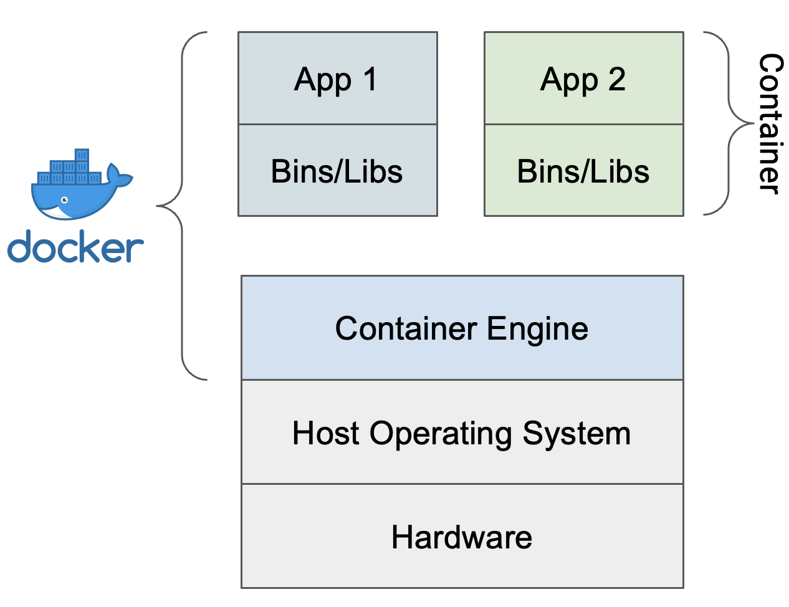
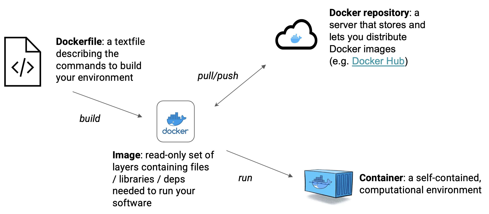
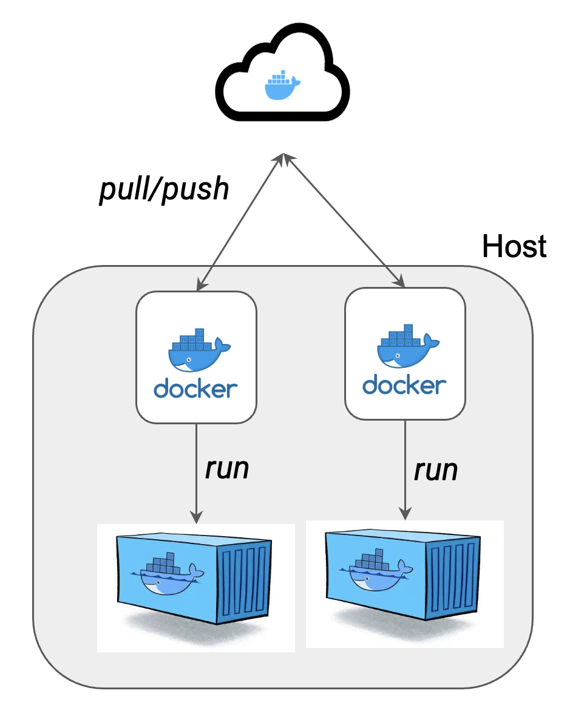
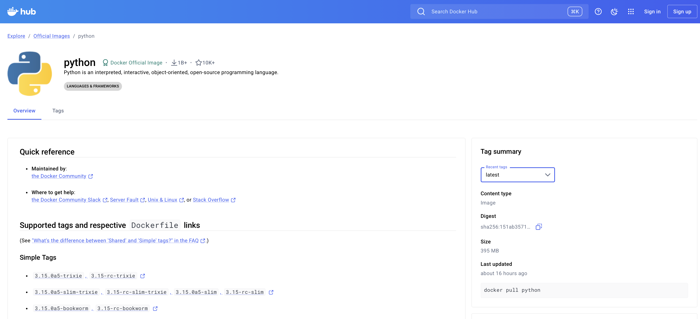
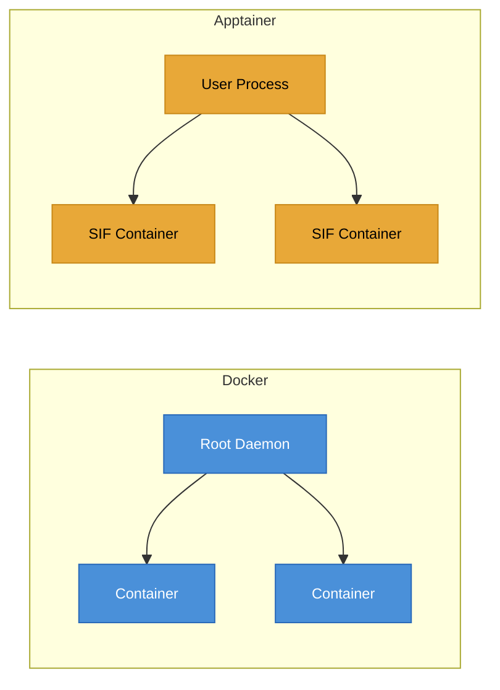

# Introduction to Docker and virtualisation

External dependencies evolve and break compatibility.

<v-clicks>

- **Virtualisation** allows multiple environments on one machine
- **Containers** are lightweight: they share the host kernel, not a full OS
- A container **image** is the template; a **container** is a running instance
- Industry standard: **Open Container Initiative** (OCI)

</v-clicks>

::right::
<div class="pl-4 flex items-center justify-center h-full">
  
</div>

---

# Docker glossary

<div class="flex items-center justify-center mt-4">
  
</div>

---

# Docker command-line interface

<v-clicks>

- Docker is primarily used via the **command line** (Docker Desktop also available)
- `docker image` manage images (`ls`, `pull`, `build`, `rm`)
- `docker container` manage containers (`run`, `ls`, `stop`, `rm`)
- Images and containers consume disk space and can be cleaned up by `docker system prune`
- `docker container ls` and `docker ps` show running containers

</v-clicks>

<div v-click class="mt-4">

```console
$ docker image ls
$ docker image pull python:3.14-slim
$ docker container run --rm -it python:3.14-slim bash
$ docker system prune
```

</div>

---
layout: two-cols
---

# Running Docker containers

<v-clicks>

- `docker image pull` downloads images from a registry
- `docker image ls` lists locally available images
- `docker container run` creates and starts a container from an image
- `-it` flags for **interactive terminal** sessions
- `--rm` flag to **auto-remove** the container on exit

</v-clicks>

<div v-click class="mt-4">

```console
$ docker image pull python:3.14-slim
$ docker image ls
REPOSITORY   TAG         IMAGE ID       SIZE
python       3.14-slim   486b8092bfb1   145MB

$ docker container run --rm -it python:3.14-slim
Python 3.14.3 (main, Feb 10 2026, 19:07:21)
>>> print("Hello from Docker!")
Hello from Docker!
```

</div>

::right::
<div class="pl-4 flex items-center justify-center h-full">
  
</div>

---
layout: two-cols
---

# Docker Hub

<v-clicks>

- Docker Hub is the default **public registry** for container images
- Provides documentation, tags, and usage examples for images
- Naming convention: `OWNER/IMAGE[:TAG]` (default tag: `latest`)
- **Prefer pinned tags** over `latest` for reproducibility
- Rate limits: 100 pulls/6h (unauthenticated), 200 pulls/6h (authenticated)
- Alternative registries: GHCR (GitHub), GCR (Google), Quay.io (Red Hat)

</v-clicks>

::right::
<div class="pl-4 flex items-center justify-center h-full">
  
</div>

<div v-click class="-mt-32 border border-teal-500 rounded p-2 text-sm text-teal-700">

Example: `docker pull python:3.14-slim` pulls the official Python image with the `3.14-slim` tag from Docker Hub.

</div>

---
layout: two-cols
---

# Dockerfiles and building images

<v-clicks>

- **Dockerfiles** specify the contents of a container image
- `docker image build` builds an image from a Dockerfile
- **FROM**: sets the base image
- **RUN**: executes commands (install deps)
- **COPY**: includes files from the host
- **CMD**: default command when container runs
- Each instruction creates a cached **layer**

</v-clicks>

::right::
<div class="pl-4 pt-8">

```dockerfile {*|*|1-2|4-10|12-13|15|*}{at:2}
# set the base image
FROM python:3.14-slim

# install system dependencies
RUN apt-get update && \
    apt-get install -y --no-install-recommends \
    figlet && rm -rf /var/lib/apt/lists/*

# install pyfiglet
RUN pip install --no-cache-dir pyfiglet

# copy entrypoint from host
COPY hello_world.py .

CMD ["python", "hello_world.py"]
```

</div>

---

# Dockerfile best practices

<v-clicks>

- **Order layers by changing frequency**: rarely changed deps first, source code last
- Use `.dockerignore` to exclude unnecessary and **secret** files (`.git/`, `.env/`, API keys etc.)
- Run as a **non-root user** for security
- Prefer `COPY` over `ADD` unless you need to deal with remote files
- Combine `RUN` commands to reduce layer count
- Use **multi-stage builds** to keep final images small

</v-clicks>

<div v-click class="mt-2">

```dockerfile
# build stage (full compiler toolchain)
FROM gcc:15 AS builder
COPY hello.c .
RUN gcc -o hello -static hello.c

# runtime stage (only binary)
FROM alpine:3.23
COPY --from=builder /hello /hello
USER dumbledore
CMD ["/hello"]
```

</div>

---

# Reproducibility and sharing

<v-clicks>

- Docker preserves the computational environment for reproducibility
- **Always build from a Dockerfile**: interactive sessions for testing
- **Pin base images** by digest for full reproducibility
  - `FROM python:3.14-slim@sha256:486b8092bfb1...`
- **Docker Hub** allows sharing but has limitations
  - Rate limits on pulls, tags can be overwritten
  - Not suitable for long-term archiving
- **Zenodo** supports uploads up to 50 GB with persistent DOIs
  - Ideal for citing containers in publications
- Keep Dockerfiles in **version control** alongside your code

</v-clicks>

---
layout: two-cols-header
---

# When to use Docker

::left::
<div class="pr-3">

<div v-click>

### Good fit

</div>

<v-clicks>

- Consistent dev environments across OS
- Microservices and web applications
- CI/CD pipelines
- Testing across different dependency versions
- Rapid deployment
- Preserving legacy applications

</v-clicks>

</div>

::right::
<div class="pl-3">

<div v-click>

### Limitations

</div>

<v-clicks>

- HPC clusters (requires root daemon)
- GPU/MPI at scale
- shared systems

</v-clicks>

<div v-click class="mt-4 border border-teal-500 rounded p-3 text-sm text-teal-700">
For HPC at Oxford ARC, use <strong>Apptainer</strong> instead.
</div>

</div>

---
layout: two-cols
---

# Apptainer (formerly Singularity)

<div class="flex justify-center mt-4">
  
</div>

<v-clicks>

- Rebranded under the **Linux Foundation** in 2021
- Designed for **HPC** and shared systems
- **Daemonless**: runs in user space, no root required
- Builds to a single **SIF** file
  - Immutable, portable, cryptographic signing
- Can pull and convert Docker/OCI images directly
- Available on **Oxford ARC** and most HPC systems

<div v-click>

```console
$ apptainer pull docker://python:3.14-slim
$ apptainer run python_3.14-slim.sif
$ apptainer shell python_3.14-slim.sif
$ apptainer run --nv gpu_app.sif
```

</div>

</v-clicks>

::right::
<div class="pl-2 pt-4 scale-70">

<div v-click class="-mt-16">



</div>

</div>

---

# Docker vs Apptainer

| | **Docker** | **Apptainer** |
|---|---|---|
| **Architecture** | Daemon-based (root) | Daemonless (user space) |
| **Isolation** | Full namespace separation | Shared host filesystem access |
| **Image format** | Layered OCI images | Single SIF file |
| **GPU support** | Via NVIDIA Container Toolkit | Native `--nv` flag |
| **Best for** | Cloud, CI/CD, microservices | HPC, shared clusters |

<div v-click class="mt-8">

- **Podman**: rootless, daemonless Docker-compatible alternative
- Common workflow: **build with Docker** locally, **run with Apptainer** on HPC
- Apptainer pulls Docker images directly: `apptainer pull docker://...`

</div>

<style>
th, td { padding: 0.2em 0.5em; }
th { border-bottom: 2px solid #888; }
</style>

---

# Practical session

- Introduction to Docker course on the training website
- Further Software Carpentry material on:
  - Containers on GitHub Actions
  - Containers on HPC with Apptainer
- Help with containerising your own code
