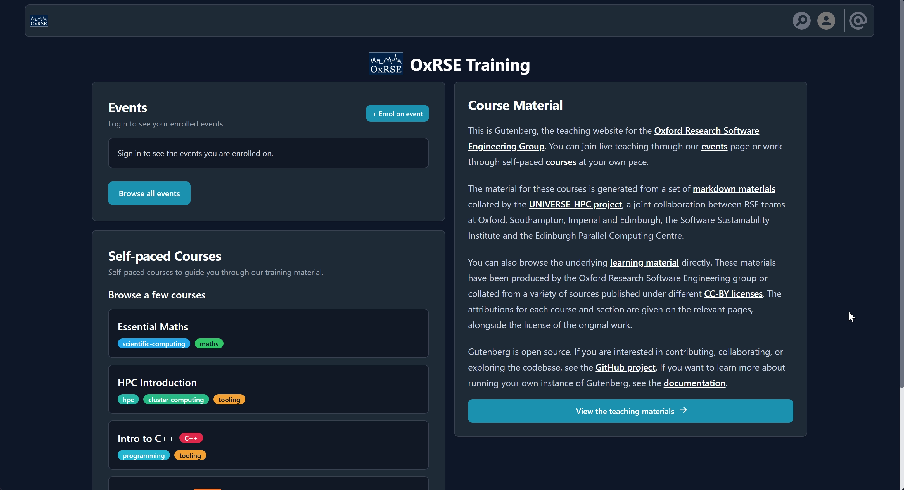
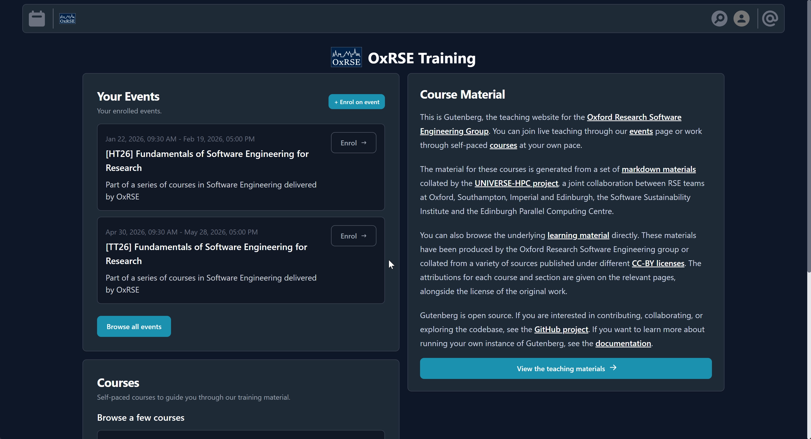
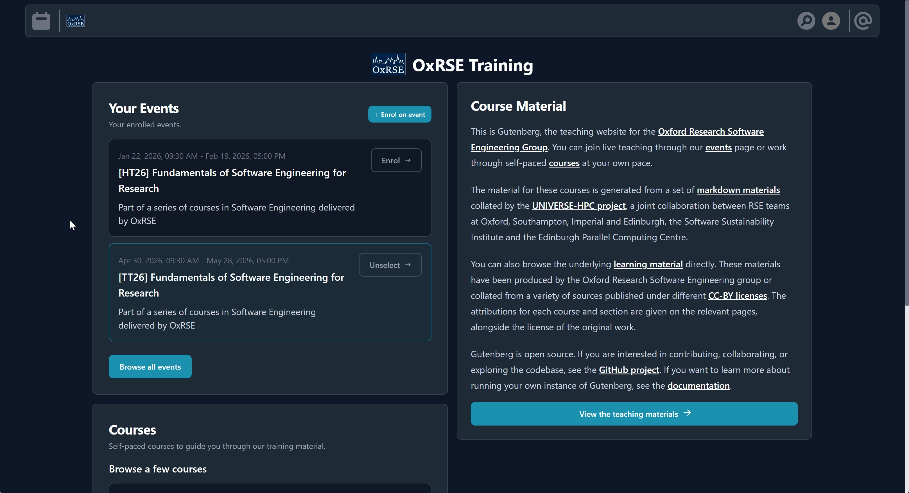
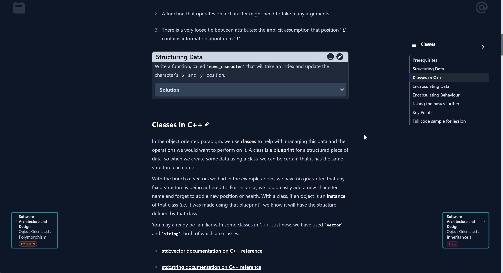
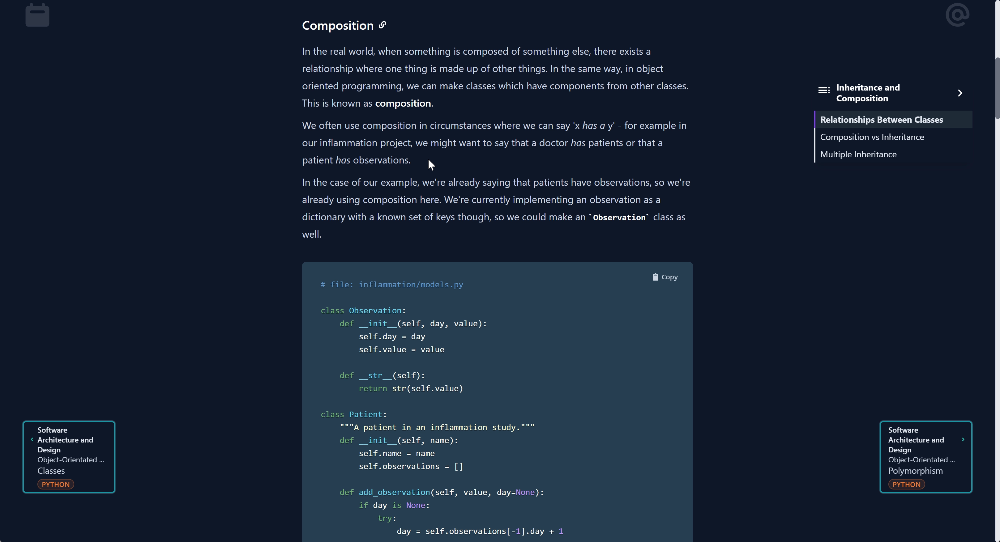

Your feedback is invaluable and will help us improve future sessions:

  

---
title: 'train.rse.ox.ac.uk: login'
---

  

---
title: 'train.rse.ox.ac.uk: enrol'
---

  

---
title: 'train.rse.ox.ac.uk: view course material'
---

  

---
title: 'train.rse.ox.ac.uk: mark exercises'
---

  

---
title: 'train.rse.ox.ac.uk: add comments'
---

  

