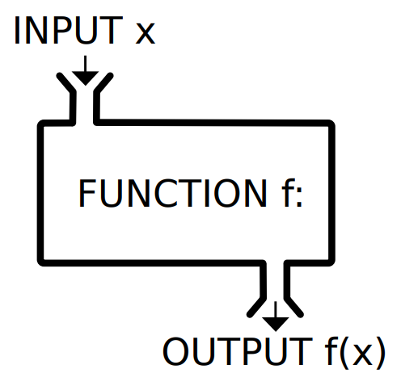
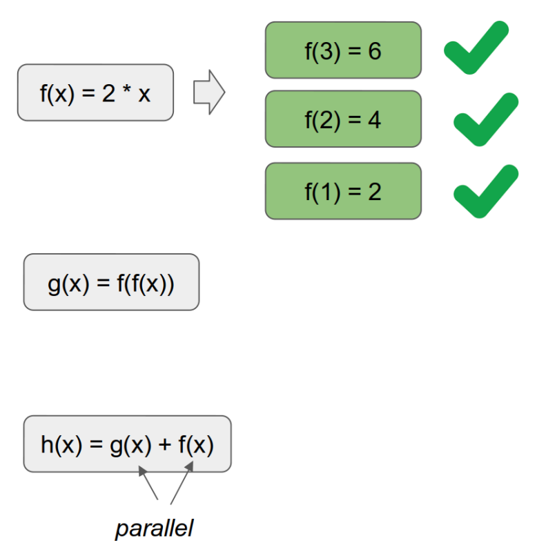
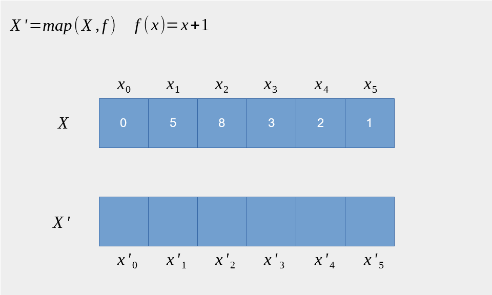
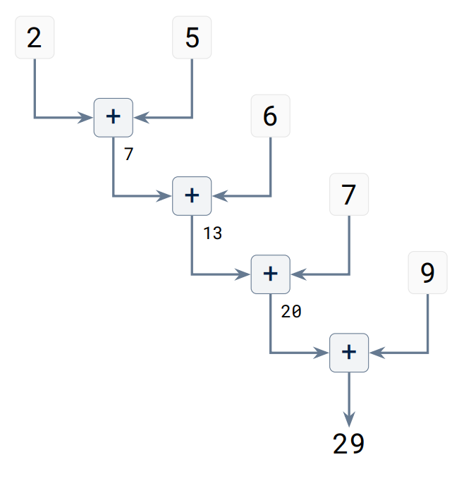

# What is functional programming?

<v-clicks>

- **Naively:** programming with functions.
- **More precisely:** programming with *pure* functions.
- **Furthermore:** programming with *higher-order* functions.

</v-clicks>

<style>
    strong { color: var(--oxrse-bg-colour); }
    ul li::marker { color: var(--oxrse-bg-colour); }
    ul { @apply flex flex-col h-100 justify-evenly text-3xl }
</style>

---
layout: two-cols-header
---

# What is a function?

::left::

{class="w-4/5"}

::right::

Python
```python
def distance(x1, y1, x2, y2):
    return ((x2 - x1) ** 2 + (y2 - y1) ** 2) ** 0.5
```

R
```r
distance <- function(x1, y1, x2, y2) {
  return (sqrt((x2 - x1) ^ 2 + (y2 - y1) ^ 2))
}
```

C++
```cpp
double distance(double x1, double y1, double x2, double y2) {
    return sqrt(pow(x2 - x1, 2) + pow(y2 - y1, 2));
}
```

---
layout: two-cols-header
class: text-xl
---

# What is a pure function?

## Our `distance` functions are pure, but what makes them so?

::left::

- They are **referentially transparent**:

  They always give the same output for the same inputs. You could replace them by their output value in the code without affecting the result.

  It doesn’t matter if you replace `sqrt(4)` with `2`, but it does if you replace `today()` with <code>{{ new Date().toISOString().slice(0, 10) }}</code>.

::right::

<v-click>

- They don't have any **side effects**:

  The state of the world after they are called is no different than before.

  Nothing changes if you call `sqrt(4)` a few times, but `launch_rocket()` is another story.

</v-click>

<style>
    strong { color: var(--oxrse-bg-colour); }
    ul li::marker { color: var(--oxrse-bg-colour); }    
    h2 { @apply mt-4 mb-4; }
</style>

---
layout: two-cols-header
---

# Impure things

::left::

- Changing the value of a variable
- Modifying a data structure in place
- Printing to the console
- Writing to a file
- Sending data over a network
- Reading from a file or the keyboard
- Fetching data from a database or API
- Getting the current time or date
- Generating a random number

::right::

<v-click>

## These things are necessary.

So why try to avoid them?

Most useful programs are impure anyway…

</v-click>

<style>
    strong { color: var(--oxrse-bg-colour); }
    ul li::marker { color: var(--oxrse-bg-colour); }    
    ul { @apply flex flex-col h-100 justify-evenly text-xl }
    .two-cols-header { column-gap: 10px; }
</style>

---
layout: default
class: text-2xl
---

# Why functional programming?

<div class = "flex flex-col h-100 justify-evenly">

**Mutability** is the source of countless bugs:

Something somewhere is not what it should be because it got changed by something else.{class="text-4xl"}

(“Mutable” is just a fancy word for “can be changed”. “Immutable” means it cannot.){class="text-xl text-gray-500"}

By limiting the things in your program that can be changed and the parts of it that can change them, bugs become easier to track.

</div>

<style>
    strong { color: var(--oxrse-bg-colour); }
    p { @apply leading-normal }
</style>

---
layout: two-cols-header
---

# Benefits of functional code

::left::

- **Testability**: pure functions are easily testable as they always produce the same output for a given input.

- **Composability**: pure functions can be combined to create new functions.

- **Parallelizability**: pure functions can be executed in parallel as they don't modify shared state.

::right::

::center
{class="w-4/5"}
::

<style>
    strong { color: var(--oxrse-bg-colour); }
    ul li::marker { color: var(--oxrse-bg-colour); }    
    ul { @apply flex flex-col h-100 justify-evenly text-2xl }
    .two-cols-header { column-gap: 30px; }
    p { @apply leading-tight }
</style>

---
layout: two-cols-header
---

# Why not functional programming

::left::

<div class = "text-2xl">

If you don’t mutate anything ever, you often have to copy lots of data, which can be costly.

Workarounds involve:

- using smart data structures that avoid copying where possible

- using mutability under the hood while providing a functional-style interface

</div>

::right::

Pandas data frames are a good example of a smart data structure:

```python
import pandas as pd

data = {'A': [1, 2, 3], 'B': [4, 5, 6]}
df1 = pd.DataFrame(data)
df2 = df1.rename(columns = {'A': 'a'})

print(df2)
```

It offers a functional interface but uses non-functional features under the hood and won’t actually copy data unless it needs to.

<style>
    ul li::marker { color: var(--oxrse-bg-colour); }    
    .two-cols-header { column-gap: 50px; }
    p { @apply leading-normal }
</style>

---
layout: two-cols
class: text-xl
---

# Where does functional programming come from?

<div class = "flex flex-col h-100 space-evenly">

The **λ-calculus**, introduced by Alonzo Church in the 1930s, is the world’s smallest programming language.

It has:
- Variables: $x$, $y$, etc.
- Function definitions: $(λ.xM)$, where $M$ is an expression.
- Function applications: $(MN)$, where $M$ and $N$ are expressions.

Anything that can be computed at all can be computed with this.

</div>

::right::

::center

{class="h-4/5"}

https://en.wikipedia.org/wiki/File:Alonzo_Church.jpg

::

<style>
    strong { color: var(--oxrse-bg-colour); }    
    ul li::marker { color: var(--oxrse-bg-colour); }    
    a { @apply text-sm }
    p { @apply leading-tight }
</style>

---

# Some notable functional languages

- **Lisp** (1960) Heavily inspired by lambda calculus. Second-oldest high-level programming language still in common use. Scheme, Clojure and Logo are dialects. Scheme inspired S which led to R.

- **Haskell** (1990) The quintessential FP language. Statically typed and “lazy”, with an emphasis on purity. _Learn You a Haskell for Great Good!_ (https://learnyouahaskell.com/) is a great intro to FP.

- **Scala** (2004) A pragmatic object/functional hybrid language that runs on the Java Virtual Machine.

- **F#** (2005) Microsoft’s take on FP for the .NET platform. Descended from ML (1973) via Caml (1985) and OCaml (1996).

- **Most** languages also support some measure of functional programming nowadays.

<style>
    strong { color: var(--oxrse-bg-colour); }
    ul li::marker { color: var(--oxrse-bg-colour); }    
    ul { @apply flex flex-col h-100 justify-evenly text-xl }
    p { @apply leading-none }
</style>

---
layout: two-cols-header
class: text-2xl
---

# First class functions

::left::

<div class = "jdiv">

**First-class functions** are functions that can be passed as arguments, returned from functions, or assigned to variables.

**Lambda functions** are small, nameless functions defined in the normal flow of the program.

</div>

::right::

<div class = "jdiv">

```python
# Functions are first-class objects in Python,
# as they can be assigned to variables:

def greet():
    return "Hello"

hello = greet
print(hello())  # Output: Hello
```

```python
# Lambda functions can be defined on the fly:
add = lambda x, y: x + y
print(add(2, 3))  # Output: 5
```

</div>

<style>
    .jdiv { @apply flex flex-col h-100 justify-evenly }
    strong { color: var(--oxrse-bg-colour); }
    .two-cols-header { column-gap: 50px; }
    p { @apply leading-normal }
</style>

---
layout: two-cols-header
class: text-2xl
---

# Higher-order functions

::left::

<div class = "jdiv">

**Higher-order functions** are functions that take other functions as arguments.

**Examples**: `map`, `filter` and `reduce` are built-in higher order functions in Python that use lazy evaluation.

</div>

::right::

<div class = "jdiv">

```python
numbers = [1, 2, 3, 4, 5]
```

```python
# map
squared= list(map(lambda x: x**2, numbers))
print(squared)
# Output: [1, 4, 9, 16, 25]
```

```python
# filter
even = list(filter(lambda x: x % 2 == 0, numbers))
print(even)
# Output: [2, 4]
```

```python
# reduce
from functools import reduce
product= reduce((lambda x, y: x * y), numbers)
print(product)
# Output: 120
```

</div>

<style>
    .jdiv { @apply flex flex-col h-100 justify-evenly }
    strong { color: var(--oxrse-bg-colour); }
    .two-cols-header { column-gap: 50px; }
    p { @apply leading-normal }
</style>

---
layout: default
---

# On the usefulness of map

<div class="w-4/5 text-5xl">

  Any time you have a collection of things and you need to transform it into another collection of equal length, `map` is what you need.

</div>

<style>
    p { @apply leading-normal }
</style>

---

# Mapping in motion

::center



<a href="https://commons.wikimedia.org/wiki/User:Loillibe">Loillibe</a>, <a href="https://commons.wikimedia.org/wiki/File:Mapping-steps-loillibe-new.gif">Mapping-steps-loillibe-new</a>, <a href="https://creativecommons.org/licenses/by-sa/4.0/legalcode" rel="license">CC BY-SA 4.0</a>

::

<style>
    a { @apply text-sm }
</style>

---
layout: two-cols-header
class: text-2xl
---

# Reductions form trees

::left::

<div class = "flex flex-col h-100 justify-evenly">

```python
from functools import reduce
reduce((lambda x, y: x + y), [2, 5, 6, 7, 9])
```

::center



::

</div>

::right::

<div class = "flex flex-col h-100 justify-evenly">

Any time you have a collection of things that needs to be boiled down to a single thing, it can be implemented via a reduction.

You already use reduction functions all the time, e.g.: `sum`, `product`, `mean`, `stdev`, `max`, `min`, `len`, `all`, `any`, etc.

</div>

<style>
    p { @apply leading-normal }
    .two-cols-header { column-gap: 50px; }
</style>

---
layout: two-cols-header
class: text-2xl
---

# Comprehensions and generators in Python

::left::

<div class = "flex flex-col h-100 justify-evenly">

**Comprehensions** are a more Pythonic way to structure map and filter operations.

**Generators** are similar to list comprehensions but behave differently and aren’t evaluated until iterated over.

</div>

::right::

<div class = "flex flex-col h-100 justify-evenly">

```python
# List comprehension
squared = [x**2 for x in numbers]
print(squared)
# Output: [1, 4, 9, 16, 25]
```

```python
# Dictionary comprehension
squared_dict = {x: x**2 for x in numbers}
print(squared_dict)
# Output: {1: 1, 2: 4, 3: 9, 4: 16, 5: 25}
```

```python
# Generator
squared_gen = (x**2 for x in numbers)
for num in squared_gen:
print(num)
# Output: 1 4 9 16 25
```

</div>

<style>
    p { @apply leading-normal }
    .two-cols-header { column-gap: 50px; }
    strong { color: var(--oxrse-bg-colour); }
</style>

---
layout: two-cols-header
class: text-2xl
---

# Decorators in Python

::left::

**Decorators** are higher-order functions that take a function as an argument and return another function (that usually enhances or modifies the behavior of the original function).

::right::

```python
def my_decorator(func):
    def wrapper():
        print("Before function call")
        func()
        print("After function call")
    return wrapper

@my_decorator
def say_hello():
    print("Hello")

# > say_hello()
# Before function call
# Hello
# After function call
```

<style>
    p { @apply leading-normal }
    .two-cols-header { column-gap: 50px; }
    strong { color: var(--oxrse-bg-colour); }
</style>

---

# A classic recursion example

<div class = "flex flex-col h-100 justify-evenly">
<div class = "text-3xl"> 
Possible definitions of the factorial function:
</div>  
<div class = "flex justify-between w-full">    
<div>
Imperative:

```python
def factorial(n):
    result = 1
    for i in range(2, n + 1):
        result = result * i
    return result
```
    
</div>
<div>
    
Mathematical:

$$
n! = \begin{cases} 1 & \text{if } n = 0 \\ n \times (n - 1)! & \text{if } n > 0 \end{cases}
$$

</div>
<div>
Functional:

```python
def factorial(n):
    if n == 0:
        return 1
    return n * factorial(n- 1)
```
</div>
</div>
  
<div class = "text-2xl">

**Caveats**: What happens if you pass a negative number? Or a really big number?

</div>
</div>


---
layout: two-cols-header
class: text-xl
---

# Conclusions

::left::

Besides benefits like **testability**, **composability** and **parallelizability**, functional programming
changes the way we think about programming.

We shift from an **imperative** mind set (“do this”) to a **declarative** one (“here is what I need”) and
programming becomes about chaining transformations to our data.

A fun little game that captures the experience well:

https://david-peter.de/cube-composer/

::right::

<v-click>

And this is just the tip of the iceberg!

There is a lot more to it than what we have seen today (e.g. monads, currying, pattern matching, algebraic data types, functional reactive programming, ...)

</v-click>

<style>
    p { @apply leading-normal }
    .two-cols-header { column-gap: 50px; }
    strong { color: var(--oxrse-bg-colour); }
</style>
