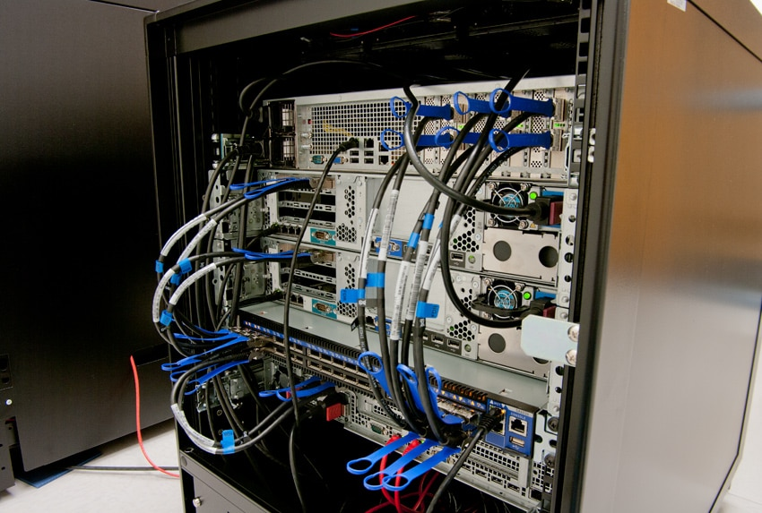
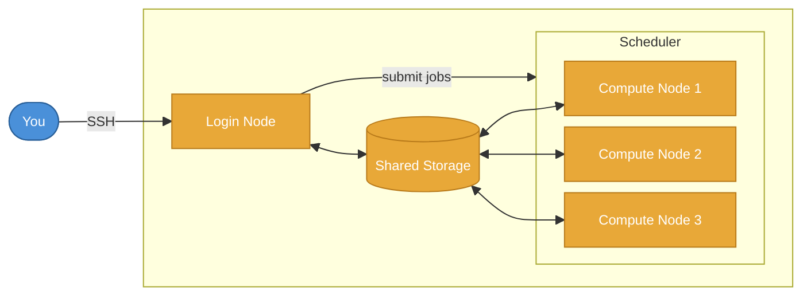

# What is HPC?

<div v-click>

**High-Performance Computing**

</div>

<div v-click>

Using many computers together to solve problems too large or slow for a single machine.

</div>

::right::
<div class="h-full w-full flex items-center justify-center pl-4">
  
</div>

---

# What is a cluster?

<div v-click>

A collection of computers (nodes) connected by a network, working as one system.

</div>

<v-clicks>

- Each node has its own processors and memory
- Nodes share a common storage system
- A scheduler coordinates which jobs to run and where they run

</v-clicks>

---
layout: two-cols
---

# What makes it high-performance?

<v-clicks>

- Not just faster individual processors - **many processors working in parallel**
- High-speed interconnects (e.g. InfiniBand) between nodes
- Large amount of memory (terabytes across the cluster)
- Parallel file systems for fast I/O (NFS, GPFS, Lustre)

</v-clicks>

::right::
<div class="h-full w-full flex items-center justify-center pl-4">
  
</div>

---

# Why will I need it?

<v-clicks>

- Computation too slow on a local workstation (from days to hours)
- Dataset too large to fit in memory
- Need to run many independent tasks
- Examples:
  - ML model training
  - climate simulations
  - molecular dynamics
  - parameter sweeps

</v-clicks>

---

# Components of an HPC system

<v-clicks>

- **Login nodes**: access point, file management, job submission
- **Compute nodes**: where jobs run (CPUs, GPUs, memory)
- **Network**: high-speed interconnects between nodes
- **Storage**: shared file systems ($HOME, $DATA)
- **Scheduler**: allocates resources and manages job queue

</v-clicks>



---

# Connect to an HPC system

SSH to a login node:

```shell
ssh username@hpc.to.connect
```

Login node etiquette: **no heavy computation**

Load software via the **module** system:

```shell
module avail            # list available software
module load Python/3    # load a specific package
module list             # show loaded modules
```

Alternatively, you can use Apptainer:

```shell
apptainer exec my_container.sif echo "hello"
apptainer run docker://alpine echo "hello"
```

---

# Scheduler in HPC

Manages fair access and priority to **shared** compute resources

You request resources -> scheduler queues your job -> runs it when resources are free

Slurm: one of the most popular scheduler for HPC system

| Command | Purpose |
|---|---|
| `sbatch` | Submit a job script |
| `squeue` | Check job status |
| `scancel` | Cancel a job |
| `sacct` | Check job accounting data |
| `sinfo` | View cluster status |
| `seff` | Check job efficiency |

<style>
th, td { padding: 0.2em 0.5em; }
</style>

---

# Submit an HPC job

The workflow:

<v-clicks>

1. Write a job script (bash + `#SBATCH` directives)
2. Submit with `sbatch myscript.sh`
3. Monitor with `squeue --me`
4. Check log/output files
5. Check efficiency with `seff <JOBID>`, especially for the first few runs.

</v-clicks>

---
lineNumbers: true
---

# An example submission script

```bash
#!/bin/bash
#SBATCH --job-name=my_job         # name shown in squeue
#SBATCH --partition=short         # partition submitted to
#SBATCH --nodes=1                 # number of nodes
#SBATCH --ntasks=4                # number of tasks
#SBATCH --cpus-per-task=4         # number of CPUs
#SBATCH --time=01:00:00           # maximum walltime (HH:MM:SS)
#SBATCH --output=result_%j.out    # output file (%j = job ID placeholder)

module load Python/3

srun python my_job.py
```

---

# How much resources should I request?

Three key resources: **CPUs**, **memory**, **walltime**

<v-clicks>

- **Under-request**: job killed before completion
- **Over-request**: longer queue wait, wasted allocation
- Start with a small test run, make sure it runs first
- Observe the scaling of resource usage with your dataset size/number of iterations etc.
- Use `seff` to help refining
  ```shell
  $ seff 12345678
  Job ID: 12345678
  CPU Utilized: 00:45:00
  CPU Efficiency: 93.75%
  Memory Utilized: 3.2 GB
  Memory Efficiency: 80.00% of 4.0 GB
  ```

</v-clicks>

---

# ARC at Oxford

- University of Oxford central HPC facility
- Clusters: **arc** and **htc**
  - CPU and GPU nodes (on *htc*)
- Scheduler: Slurm
- Login:
  ```shell
  ssh -Y username@arc-login.arc.ox.ac.uk # for arc cluster
  ssh -Y username@htc-login.arc.ox.ac.uk # for htc cluster
  ```
  - Graphical SSH clients: PuTTY, MobaXterm
  - Use SSH keys for security (private/public key pair)
---

# Storage Options in ARC

HPC systems provide multiple storage areas with different purposes:

| Storage     | Path                         | Use                    | Notes                  |
|-------------|------------------------------|------------------------|------------------------|
| **Home**    | `/home/username`             | Personal files         | 15 GiB quota           |
| **Data**    | `/data/projectname/username` | Shared project storage | 5 TiB quota            |
| **Scratch** | `$SCRATCH`                   | Temporary job files    | Deleted on job exit    |
| **Tmpdir**  | `$TMPDIR`                    | Local node storage     | Deleted on job exit    |

---
layout: iframe-right
url: https://arc-user-guide.readthedocs.io/en/latest/
---

# ARC user guide

Docs: <https://arc-user-guide.readthedocs.io/en/latest/>

---

# Conclusion

<v-clicks>

- HPC: many computers working together on your problem
- Access via SSH, manage software with modules or Apptainer
- Submit jobs through the scheduler (Slurm)
- Start small, then scale
- Consult the HPC documentation and support team

</v-clicks>

---
layout: two-cols
---

# Fun Fact
The MareNostrum supercomputer in Barcelona is housed in a neo-Gothic chapel.
It was featured in Dan Brown's *Origin* (2017).

::right::
<div class="h-full w-full flex items-center justify-center">
  
</div>
