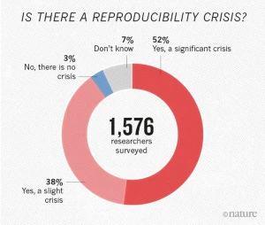
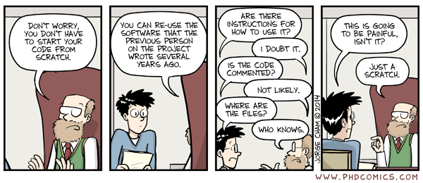
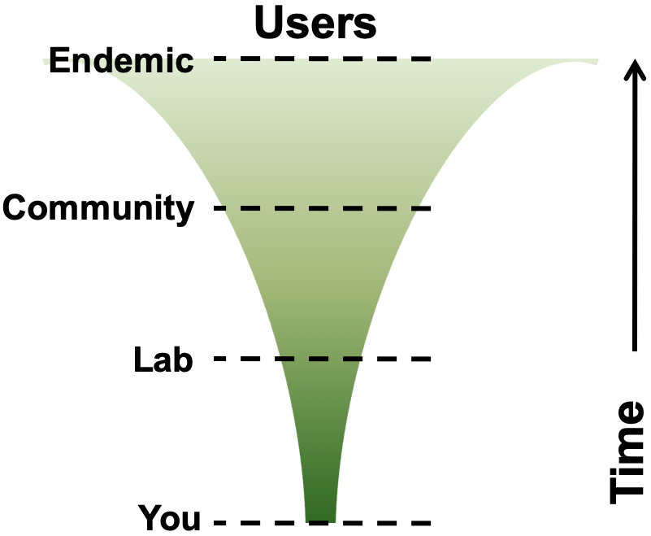
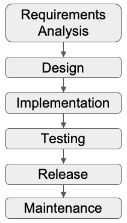
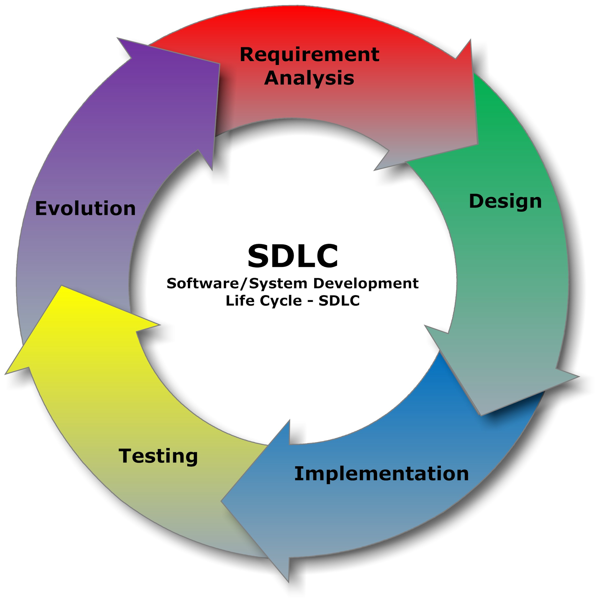
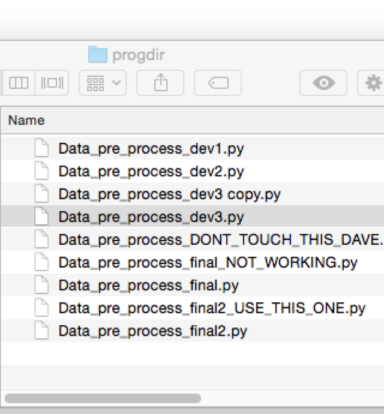
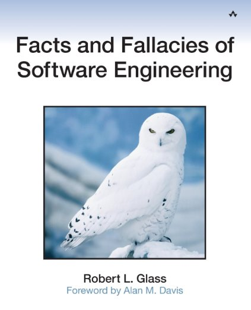

# Introduction

::center

## Why engineer research software?

::

---
layout: center
---

# Research is impossible without software

From thrown-together scripts, through an abundance of complex spreadsheets, to the millions of lines of code behind large-scale infrastructure, there are few areas where software does not play a fundamental part in research

<!--
‘Not MY software’... ‘Doesnt affect my scripts on my desktop’ lets think about what the lifecycle of those scripts are…

Your software (experiments, analysis, meta analyses, visualisation) produces the results for articles from your lab

Articles are picked up by news agencies and government policy advisories to shape public opinion and government policy

Need to ensure transparency, reproducibility, potential for expansion and collaboration, correctness

Quite scary - suddenly a great emphasis on your code; you want it to be correct, you need it to be well documented.. Or even yourself in 6 months when your writing up

Make life easy for yourself NOW and structure your code
-->

---
layout: two-cols-header
---

# Why should we care about software?

::left::

- "1,500 scientists lift the lid on reproducibility", Nature 2016
  - 1,576 respondents
- 52%: a significant crisis of reproducibility
- 31%: think that failure to reproduce means wrong result
- 73% said they think that at least half of the papers in their field can be trusted

::right::

::center

::

---
layout: center
transition: "none"
---

# Idealised research software lifecycle

::center

  <!-- Cascading boxes -->
  

    Research Questions
  

  

    Develop Software
  

  

    Run Software
  

  

    Analyse Data
  

  

    Publish Paper
  

  

    Project Ends
  

  <FancyArrow x1="20" y1="40" x2="60" y2="84" arc="-0.4" head-size="15" />
  <FancyArrow x1="85" y1="105" x2="125" y2="150" arc="-0.4" head-size="15" />
  <FancyArrow x1="150" y1="170" x2="190" y2="212" arc="-0.4" head-size="15" />
  <FancyArrow x1="210" y1="230" x2="255" y2="275" arc="-0.4" head-size="15" />
  <FancyArrow x1="270" y1="295" x2="320" y2="340" arc="-0.4" head-size="15" />

::

<!--
'Waterfall' model

Highly unrealistic; also treats software developed as disposable

Software increasingly DEMANDED to be open access published by journals, reproduce your results

With pressure to published, there has been a reproducilbiity crisis in science
-->

---
layout: center
---

# In reality...

::center

  <!-- Cascading boxes -->
  

    Research Questions
  

  

    Develop Software
  

  

    Run Software
  

  

    Analyse Data
  

  

    Publish Paper
  

  

    Project Ends
  

  
  

    Graceful Decline
  

  <!-- Forward paths -->
  <FancyArrow x1="20" y1="40" x2="60" y2="84" arc="-0.4" head-size="15" />
  <FancyArrow x1="85" y1="105" x2="125" y2="150" arc="-0.4" head-size="15" />
  <FancyArrow x1="150" y1="170" x2="190" y2="212" arc="-0.4" head-size="15" />
  <FancyArrow x1="210" y1="230" x2="255" y2="275" arc="-0.4" head-size="15" />
  <FancyArrow x1="270" y1="295" x2="320" y2="340" arc="-0.4" head-size="15" />
  <FancyArrow x1="462" y1="340" x2="517" y2="340" head-size="15" />

  

    Project Partners
  

  

    Industry
  

  

    Other People
  

  <!-- Project partners -->
  <FancyArrow x1="-70" y1="155" x2="-5" y2="15" arc="0.4" head-size="15" color="gray" />
  <FancyArrow x1="-40" y1="200" x2="125" y2="150" arc="-0.3" head-size="15" color="gray"/>
  <FancyArrow x1="-70" y1="155" x2="60" y2="84" arc="0.4" head-size="15" color="gray"/>
  <FancyArrow x1="-40" y1="200" x2="190" y2="212" arc="-0.2" head-size="15" color="gray"/>

  <!-- Industry -->
  <FancyArrow x1="0" y1="235" x2="-5" y2="15" arc="0.4" head-size="15" color="gray"/>
  <FancyArrow x1="0" y1="235" x2="125" y2="150" arc="-0.3" head-size="15" color="gray"/>
  <FancyArrow x1="0" y1="235" x2="60" y2="84" arc="0.4" head-size="15" color="gray"/>
  <FancyArrow x1="60" y1="260" x2="190" y2="212" arc="-0.2" head-size="15" color="gray"/>

  <!-- Other people -->
  <FancyArrow x1="120" y1="320" x2="-5" y2="15" arc="0.4" head-size="15" color="gray"/>
  <FancyArrow x1="120" y1="320" x2="125" y2="150" arc="-0.3" head-size="15" color="gray"/>
  <FancyArrow x1="120" y1="320" x2="60" y2="84" arc="0.4" head-size="15" color="gray"/>
  <FancyArrow x1="120" y1="320" x2="190" y2="212" arc="-0.2" head-size="15" color="gray"/>

  <!-- Backpaths -->
  <FancyArrow x1="430" y1="315" x2="205" y2="15" arc="-0.4" head-size="15" color="gray"/>
  <FancyArrow x1="370" y1="250" x2="205" y2="15" arc="-0.4" head-size="15" color="gray"/>
  <FancyArrow x1="370" y1="250" x2="250" y2="80" arc="-0.4" head-size="15" color="gray"/>
  <FancyArrow x1="300" y1="190" x2="250" y2="80" arc="-0.4" head-size="15" color="gray"/>
  <FancyArrow x1="300" y1="190" x2="205" y2="15" arc="-0.4" head-size="15" color="gray"/>
  <FancyArrow x1="250" y1="125" x2="250" y2="80" arc="-0.4" head-size="15" color="gray"/>
  <FancyArrow x1="85" y1="105" x2="255" y2="275" arc="-0.4" head-size="15" color="gray"/>

  What happens when…
  <ul>
  <li>You have a follow-on project?</li>
  <li>Someone else wants to use your code?</li>
  <li>Someone wants to reproduce your results?</li>
  </ul>

::

<!--
Project partners: MSc, undergrad, different version of software

End of process of continual iteration we publish a paper; even then the software doesnt die, supports the lab for the next 5-10 years in various guises.
-->

---
layout: center
---

# Legacy code

::center

::

<v-clicks at="0" every="2">

- What are your experiences re-running or adjusting a script you created few months ago?
- Have you continued working from a previous student's code?
- Are you afraid to alter existing code for fear of it breaking?

</v-clicks>

---
layout: two-cols-header
---

# The software you write is important!

::left::

- Software inherently contains value
  - Produces results, contains lessons learnt, effort

- Difficult to gauge to what extent it might be used in the future
  - By who?
  - Which parts?
  - Which projects?
  - Reproducibility – from publications!

Can it / should it be reusable by others... including yourself?

::right::

::center

::

---
layout: two-cols-header
---

# Ariane-5

::left::

- Ariane 5
- $7B development
- $500 milion rocket
- Used Ariane 4 code

<v-click>

Loss of guidance & altitude info

</v-click>

<v-click>
<FancyArrow x1="50" y1="300" x2="60" y2="340" arc="-0.4" head-size="15" color="black"/>

64-bit fp converted to 16-bit signed integer

</v-click>

<v-click>
<FancyArrow x1="70" y1="380" x2="80" y2="420" arc="-0.4" head-size="15" color="black"/>

<b>BOOM!</b>

</v-click>

::right::

::center

::

---
layout: two-cols-header
---

# Programming vs Engineering

::left::

 

## Programming / Coding

 

- Focus is on one aspect of software development
- Writes software for themselves
- Mostly an individual activity
- Writes software to fulfil research goals (ideally from a design)

::right::

 

## Engineering

 

- Considers the lifecycle of software
- Writes software for stakeholders
- Takes team ethic into account
- Applies a process to understanding, designing, building, releasing, and maintaining software

<v-click>

<i>Programmers tend to start coding right away. Sometimes this works.</i> - Eric Larsen, 2018

</v-click>

---
layout: center
---

# Where are you?

  <!-- Line labels -->
  

    <b>Software Engineering</b>
  

  

    <b>Research</b>
  

  <!-- Centre line -->
  

  

  

  

  <!-- Here -->
  

    <b>Here</b>
  

  <Arrow x1="320" y1="110" x2="320" y2="180" head-size="15" color="black"/>

  <!-- Software engineer -->
  

    Software engineer
  

  <Arrow x1="126" y1="255" x2="126" y2="195" head-size="15" color="gray"/>

  <!-- Research developer -->
  

    Research developer
  

  <Arrow x1="426" y1="255" x2="426" y2="195" head-size="15" color="gray"/>

  <!-- Researcher -->
  

    Researcher
  

  <Arrow x1="526" y1="122" x2="526" y2="177" head-size="15" color="gray"/>

---
layout: two-cols-header
---

# Beyond building a 'sequence of instructions'

::left::

Software is far more than that...
- **Outcome of a development process**

But also...
- Architecture
- Implementation of algorithms
- Data model
- Documentation
- *Best practices and conventions...*

::right::

  

    <h2 class="text-2xl font-semibold mb-4">Waterfall</h2>
    
  

  

    <h2 class="text-2xl font-semibold mb-4">Agile</h2>
    
  

---
layout: two-cols-header
---

# Testing

::left::

- Humans are fallible! Our software *will* contain defects
  - In requirements, design, as well as code
  - 1-10-150 hours to fix in design/development/production
- **Validation:** are we building the *right product*?
- **Verification:** are we building the *product right*?
  - Manual testing, unit testing, automated testing, code reviews
- Highly-cited papers published on multidrug resistance transporters between 2001 - 2010
- Results couldn't be reproduced - 5 retractions
- Caused by error in an internal software utility
  - Flipped two columns of data, inverting electron-density map used to derive protein structure

::right::

*“I didn't question it then. Obviously now I check it all the time."* - Geoffrey Chang

---
layout: two-cols-header
---

# Platform support?

::left::

... Density functional theory nuclear magnetic resonance calculations established the relative configurations of compounds 1 and 2 and revealed that **the calculated shifts depended on the operating system when using the “Willoughby–Hoye” Python scripts to streamline the processing of the output files, a previously unrecognized flaw that could lead to incorrect conclusions.**

- Due to *different sorting of file names* on different operating systems

::right::

::center

Organic Letters, October 8 2019. https://doi.org/10.1021/acs.orglett.9b03216

::

---
layout: two-cols-header
---

# Code management & collaboration

::left::

- *Version control* provides a full history of your project's software and other assets
- Makes for easy:
  - Backups
  - Collaboration
  - Recovering from dead-ends
- What should be in version control?
  - Code, documentation, tests, test data, analysis scripts
  - Reports, papers, etc.
- Packaging and deployment

::right::

::center

*“If you’re not using version control, whatever else you might be doing with a computer, it’s not science."* - Greg Wilson, SWC

::

---

# Other key points

- These skills will save you time
- Always assume others will use and develop your software
- Be clear on requirements and assume they will change
- Funders are increasingly expecting software outputs to be sustainable and reusable

---
layout: center
---

# More on software engineering

Robert L Glass, Addison-Wesley Professional

---

# A note on AI in Oxford

- Where possible you should use an AI tool approved by the University (SSO-linked):
  - https://www.ox.ac.uk/ai-oxford

 

- ChatGPT

- Codex

- Gemini

- NotebookLM

---
layout: two-cols-header
---

# AI in Learning: Opportunities

::left::

- Instant feedback and debugging help
- Faster experimentation and iteration
- Exposure to clean, varied coding patterns
- Adaptive, self-paced learning support

::right::

::center

::

---
layout: two-cols-header
---

# AI in Learning: Pitfalls

::left::

- Shallow understanding from code copying
- Weak problem-solving independence
- Overreliance on AI suggestions
- Poor grasp of design patterns

::right::

::center

::

<b>Be mindful of how you use AI: make sure it is working for you!</b>

---
layout: two-cols-header
---

# The material

::left::

[https://train.rse.ox.ac.uk/](https://train.rse.ox.ac.uk/)

- Prerequisites: Basic bash and Python proficiency
- Next is: Programming paradigms
- Tick off exercises as you complete them (demo)

- Questions/stuck?
  - RSE on hand to help out
  - Add questions on the training website (demo)

Enjoy yourselves!

::right::

::center

::
