# Session Plan

2.5 hours in total: lecture + practical

- Lecture (first 30-45 mins)
- Practical session working through course material
  - Demonstrators available to answer questions

---

# Programme Structure

<v-clicks>

- Many ways to structure the same programme
- Important because it affects:
  - Maintainability
  - Extensibility
- No substitute for proper planning:
  - What entities do we need to represent?
  - What data do we need about them?
  - How are those entities related?

</v-clicks>

---
layout: two-cols
---

# Example: Astrophysics

```python
temperature = 0
steps = int(1e8)

for _ in range(steps):
    gas = initialise_gas(temperature)
    photons = generate_photons()
    temperature += calculate_temperature(gas, photons)

print(f"Temperature is: {temperature}")
```

::right::

<div class="pl-32">

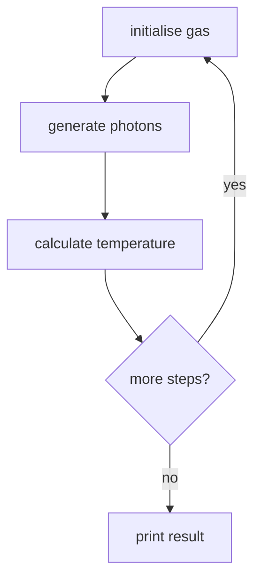
</div>

---
layout: two-cols
---

# Example: Astrophysics

```python
temperature = 0
steps = int(1e8)
photon_source = "Black hole"

for _ in range(steps):
    gas = initialise_gas(temperature)
    if photon_source == "Black hole":
        photons = generate_photons_black_hole()
    elif photon_source == "White dwarf":
        photons = generate_photons_white_dwarf()
    temperature += calculate_temperature(gas, photons)

print(f"Temperature is: {temperature}")
```

<v-clicks>

- Expand to a new use case
- Add another photon source while reusing existing logic

</v-clicks>

::right::

<div class="pl-16">

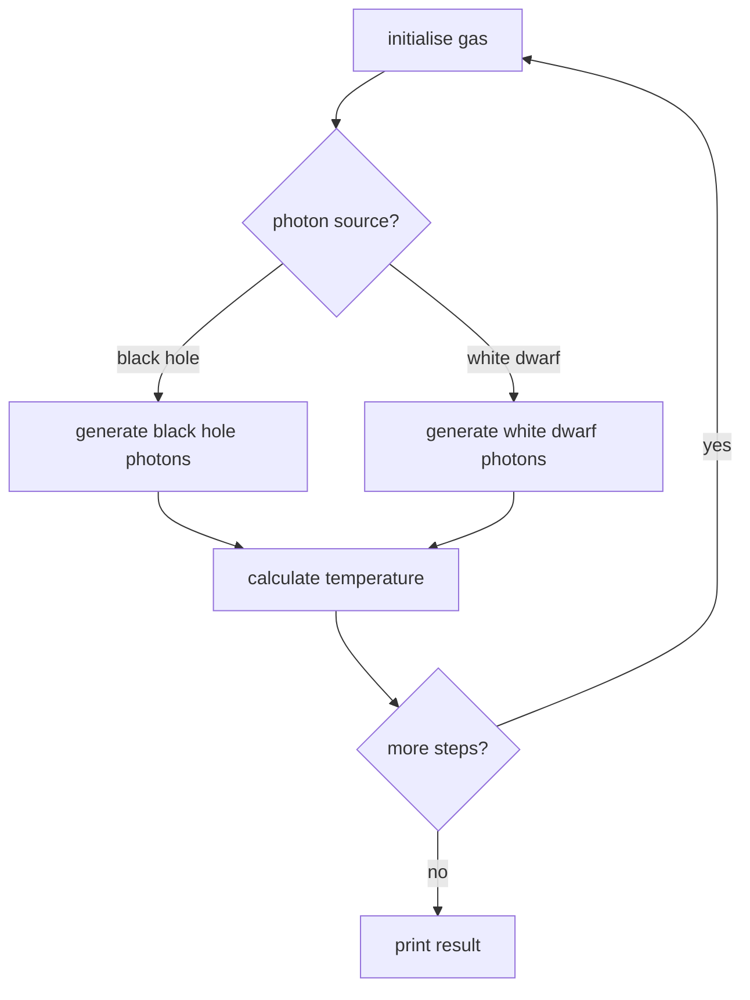

</div>

---
layout: two-cols
---

# Example: Astrophysics

```python {*}{maxHeight:'320px'}
temperature = 0
steps = int(1e8)
photon_source = "Black hole"
temperature_model = "Matthews"

for _ in range(steps):
    gas = initialise_gas(temperature)
    if photon_source == "Black hole":
        photons = generate_photons_black_hole()
    elif photon_source == "White dwarf":
        photons = generate_photons_white_dwarf()

    if temperature_model == "Matthews":
        temperature += calculate_temperature_matthews(gas, photons)
    elif temperature_model == "Sims":
        temperature += calculate_temperature_sims(gas, photons)

print(f"Temperature is: {temperature}")
```

<v-clicks>

- Modify existing behaviour for another model
- Branching starts to spread through core loops

</v-clicks>

::right::

<div class="pl-32">

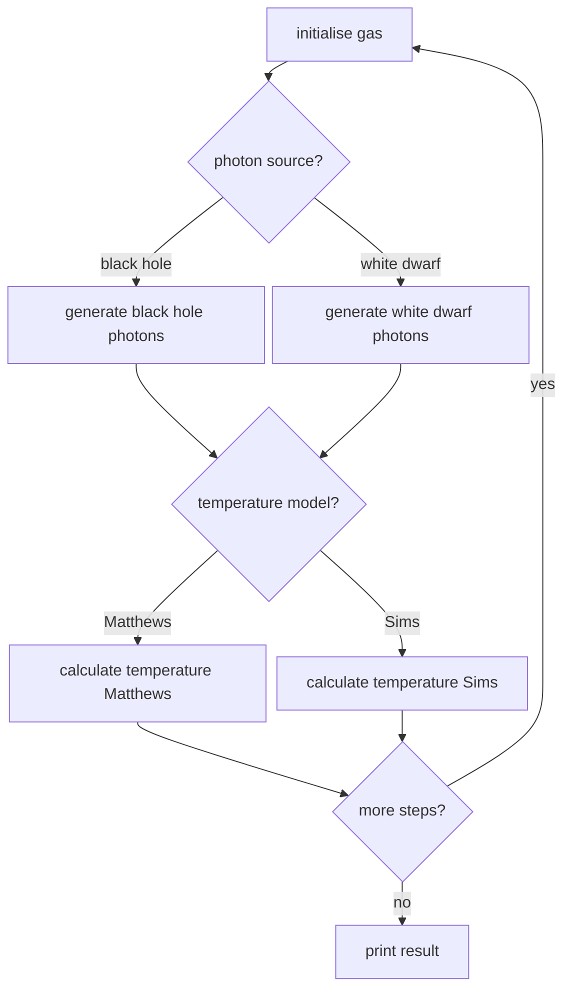

</div>

---
layout: two-cols
---

# Example: University Department

<v-clicks>

- Toy model: simple but illustrative
- <span class="font-bold">Purpose</span>: record papers written by the department
- Data and behaviour are separate:
  - `academics` and `papers` store state
  - `write_paper()` modifies the state

</v-clicks>

::right::

```python
academics = []
papers = []

def write_paper(academics, papers, academic, paper):
    academics.append(academic)
    papers.append(paper)

write_paper(academics, papers, "Sam Mangham", "Mangham2018")
write_paper(academics, papers, "Steve Crouch", "Crouch2016")
```

---
layout: two-cols
---

# Example: University Department

- Clear split between <span class="text-[#1f5f99] font-semibold">data</span> and <span class="text-[#2f7d32] font-semibold">functions</span>

<div class="mt-8">

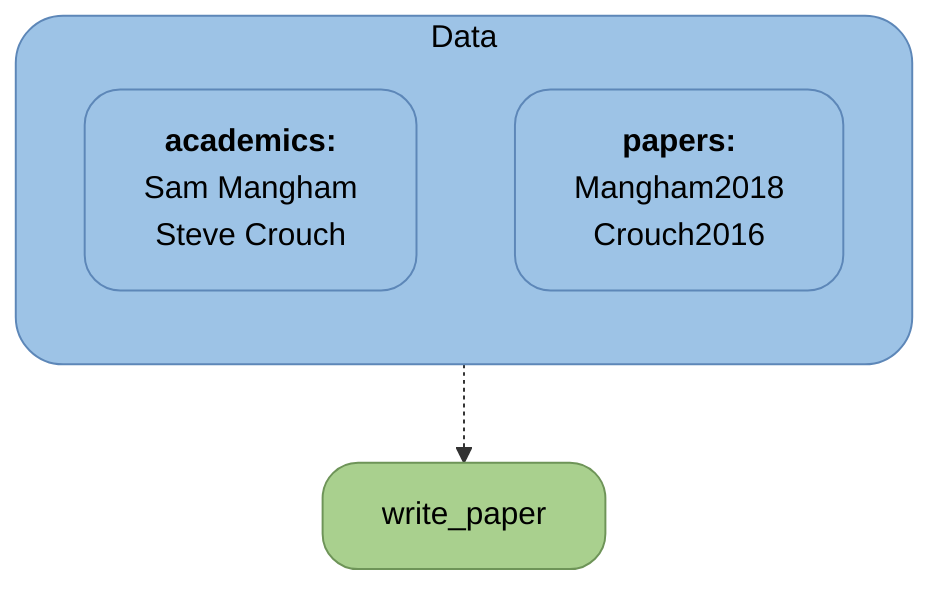

</div>

::right::

```python
academics = []
papers = []

def write_paper(academics, papers, academic, paper):
    academics.append(academic)
    papers.append(paper)

write_paper(academics, papers, "Sam Mangham", "Mangham2018")
write_paper(academics, papers, "Steve Crouch", "Crouch2016")
```

---
layout: two-cols
---

# Example: University Department

- <span class="text-[#1f5f99] font-semibold">Data</span> meaning becomes unclear!

<div class="mt-8">

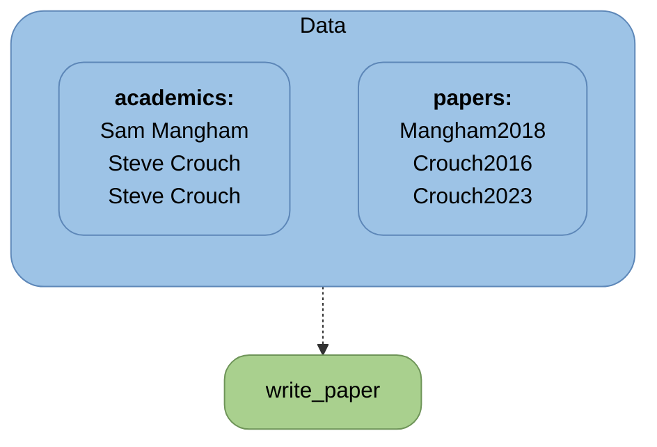

</div>

::right::

```python
academics = []
papers = []

def write_paper(academics, papers, academic, paper):
    academics.append(academic)
    papers.append(paper)

write_paper(academics, papers, "Sam Mangham", "Mangham2018")
write_paper(academics, papers, "Steve Crouch", "Crouch2016")
write_paper(academics, papers, "Steve Crouch", "Crouch2023")
```

---
layout: two-cols
---

# Object-Oriented Programming (OOP)

<v-clicks>

- Procedural style often separates structured <span class="text-[#1f5f99] font-semibold">data</span> from the <span class="text-[#2f7d32] font-semibold">operations</span> on them
- OOP puts state and behaviour into classes
- Procedural design thinks about task flow
- OOP design starts from entities (objects) and their relationships
- Classes define interfaces for safe and consistent interaction with <span class="text-[#1f5f99] font-semibold">data</span>

</v-clicks>

::right::

<div class="h-full flex items-start justify-center pl-8">

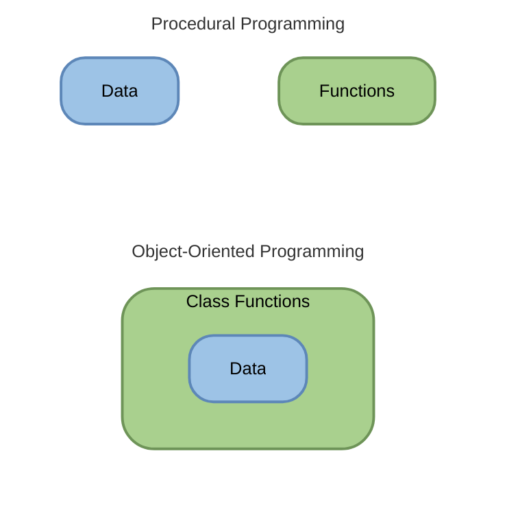

</div>

---
layout: two-cols
---

# Encapsulation

<v-clicks>

- Classes bundle related <span class="text-[#1f5f99] font-semibold">data</span> (<span class="text-[#1f5f99] font-semibold">attributes</span>) and <span class="text-[#2f7d32] font-semibold">functions</span> (<span class="text-[#2f7d32] font-semibold">methods</span>) together
- Classes are blueprints of the entities you represent
- Objects are instances of classes
- Objects can share behaviour while storing different <span class="text-[#1f5f99] font-semibold">data</span> and states

</v-clicks>

::right::

<div class="h-full flex flex-col items-center pl-6">
<div class="text-center w-[88%] mb-2 text-[15px] leading-tight font-normal">Procedural Programming</div>

<div class="w-[88%] flex justify-center">

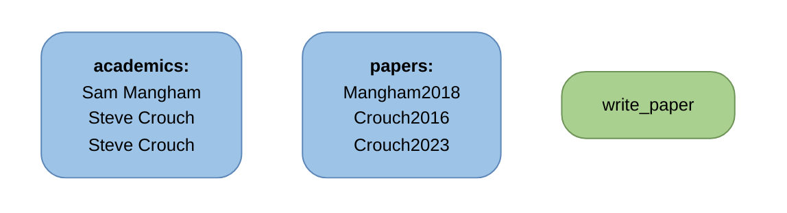

</div>

<div class="text-center w-[88%] mb-2 text-[15px] leading-tight font-normal">Object-Oriented Programming</div>

<div class="w-[88%] flex justify-center">

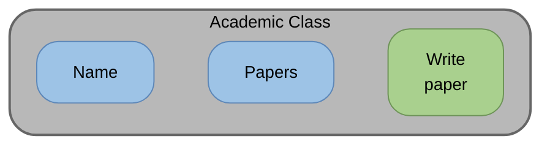

</div>

<div class="mt-3 w-full flex flex-col gap-2 items-center">
<div class="w-[88%] flex justify-center">

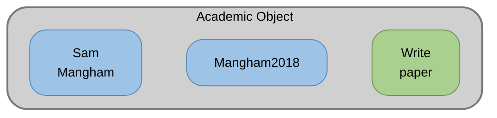

</div>
<div class="w-[88%] flex justify-center">

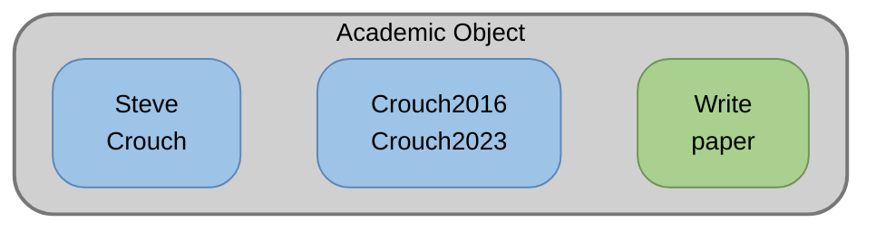

</div>
</div>
</div>

---
layout: two-cols
---

# Defining a Class in Python

<v-clicks>

- A class is a template for creating objects
  - Use the CapWords convention
- `__init__` runs when an object is created
  - This is one of the many 'dunders' methods
- `self` refers to the specific object being operated on

</v-clicks>

::right::

```python {none|1|2-4|2-4,6-7}{at:1}
class Academic:
    def __init__(self, name):
        self.name = name
        self.papers = []

    def write_paper(self, title):
        self.papers.append(title)
```

---
layout: two-cols
---

# Creating Objects

<v-clicks>

- Each object has its own independent state
- Same class, different data
- `Academic` is the class while `sam` and `steve` are objects (instances of classes)
- Think of `sam.write_paper("X")` as calling `Academic.write_paper(sam, "X")`

</v-clicks>

::right::

```python
sam = Academic("Sam Mangham")
sam.write_paper("Mangham2018")

steve = Academic("Steve Crouch")
steve.write_paper("Crouch2016")
steve.write_paper("Crouch2023")

print(sam.papers)    # ["Mangham2018"]
print(steve.papers)  # ["Crouch2016", "Crouch2023"]
```

---
layout: two-cols
---

# Defining a Class in C++

<v-clicks>

- C++ enforces type safety and access control at compile time
- Data members are private by default in robust class design

</v-clicks>

::right::

```cpp
#include <string>
#include <utility>
#include <vector>

class Academic {
 public:
  explicit Academic(std::string name) : name(std::move(name)) {}

  void write_paper(const std::string& title) {
    papers.push_back(title);
  }

 private:
  std::string name;
  std::vector<std::string> papers;
};
```

```cpp
Academic sam("Sam Mangham");
sam.write_paper("Mangham2018");
```

---
layout: two-cols
---

# Entity Diagrams

<v-clicks>

- Consider the entities in your problem
  - What do they do?
  - What properties do they have?
  - How do they relate?
- Let us consider a university department...

</v-clicks>

::right::

<div v-click>

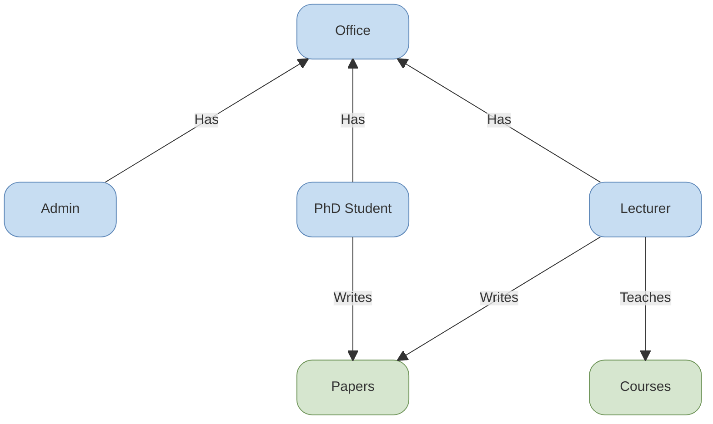

</div>

---
layout: two-cols
---

# Inheritance and Composition

<v-clicks>

- Inheritance models an "is-a" relationship
- Composition models a "has-a" relationship
- Use inheritance only for true subtype relationships, not code reuse

</v-clicks>

::right::

<div class="pl-32">

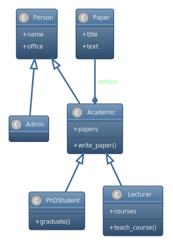

</div>

---
layout: two-cols
---

# Inheritance and Composition

<v-clicks>

- A similar problem can be modelled with composition instead
- Think of `Author` and `Instructor` as roles
- This avoids deep inheritance chains
- Pick the design with the clearest maintenance path

</v-clicks>

::right::

<div class="pl-16">

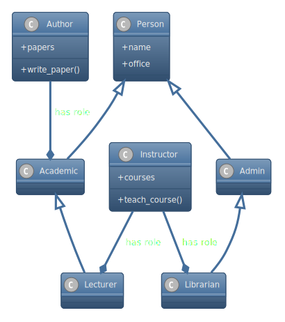

</div>

---
layout: two-cols
---

# Diamond inheritance

<v-clicks>

- Multiple inheritance can create ambiguous paths
- Which parent's method gets called?
- Languages handle this differently:
  - Python: method resolution order (MRO)
  - C++: virtual inheritance
- This complexity is a major reason to prefer composition if possible

</v-clicks>

::right::

<div class="pl-8">

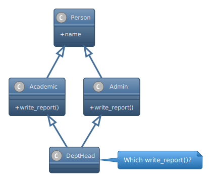

</div>

---
layout: two-cols
---

# Polymorphism

<v-clicks>

- Same interface, different implementations
- Abstract classes/interfaces are not instantiated directly
- Concrete subclasses provide behaviour-specific overrides

</v-clicks>

::right::

<div class="pl-10">

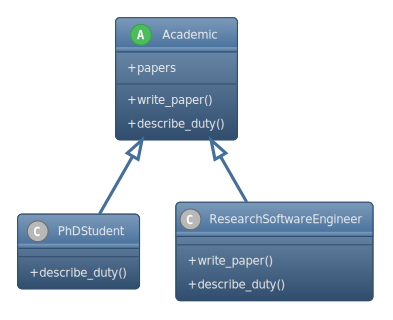

</div>

---
layout: two-cols
---

# Example: Object-Oriented Redesign

<v-clicks>

- Abstract base class defines the interface
  - All subclasses of `PhotonSource` must have the method `generate`
- Concrete subclasses provide specific behaviour
  - Different `PhotonSource` have different ways to `generate` photons
- No `if/elif` branching needed: just swap the subclass

</v-clicks>

::right::

```python {all|1-3|5-8,10-13|all}{at:1}
class PhotonSource:
    def generate(self):
        raise NotImplementedError

class BlackHole(PhotonSource):
    def generate(self):
        # black hole photon generation
        return photons

class WhiteDwarf(PhotonSource):
    def generate(self):
        # white dwarf photon generation
        return photons
```

---

# Example: Object-Oriented Redesign

<div class="flex justify-center">
  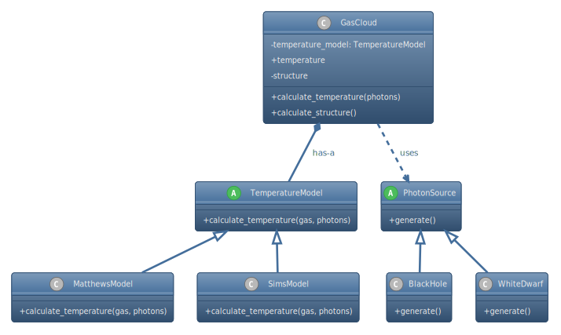
</div>

---
layout: two-cols
---

# Example: Object-Oriented Redesign

<v-clicks>

- Polymorphism: `PhotonSource` is abstract
- Composition: `GasCloud` owns a temperature model
- Encapsulation: temperature logic and state live inside `GasCloud`
- Inheritance: `SimsModel` is a temperature model

</v-clicks>

::right::

```python
steps = int(1e8)
photon_source = BlackHole()
gas_cloud = GasCloud(
    temperature_model=SimsModel(),
    start_temperature=0,
)

for _ in range(steps):
    gas_cloud.calculate_structure()
    photons = photon_source.generate()
    gas_cloud.calculate_temperature(photons)

print(f"Temperature is: {gas_cloud.temperature}")
```

---

# Today's Session

- Python (or C++)
  - Classes
- Design concepts
  - Encapsulation
  - Composition
  - Inheritance
  - Polymorphism
