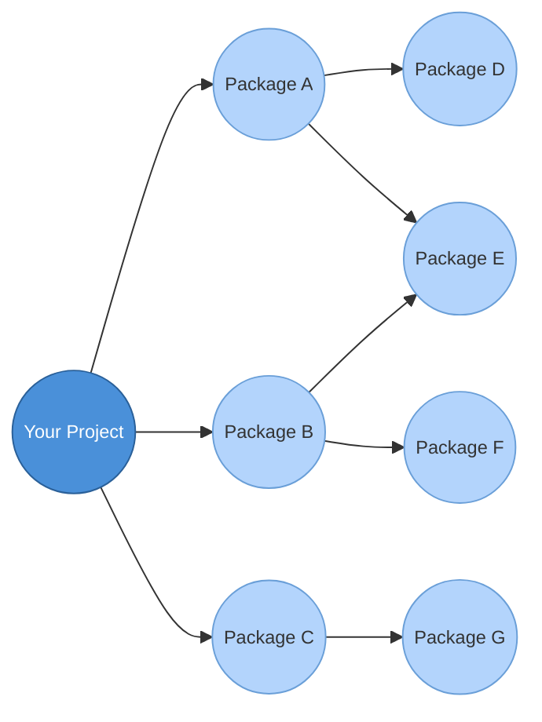

# What is a package?

<v-clicks>

- Packages are a bundle of code, resources, and metadata
  - Clear and standard organisation of software
  - Reusable across different projects
  - Easily shareable
- Packages can be found in any software ecosystem
  - Python: *numpy*, *pandas*, *matplotlib*
  - R: *ggplot2*, *rlang*
  - JavaScript: *React*, *lodash*
  - Linux: *git*, *bash*, *gcc*, *docker*

</v-clicks>

---
layout: two-cols-header
---

# Packages vs scripts

::left::
<div class="pr-3">

<div v-click>

### Scripts

</div>

<v-clicks>

- Often standalone files for a specific task
- Quick to write
- Often not reusable
- May lack docs, tests, and versioning

</v-clicks>

<div v-click class="mt-4">

```text
analysis_2.py
final.py
```

</div>

</div>

::right::
<div class="pl-3">

<div v-click>

### Packages

</div>

<v-clicks>

- Structured collection of functions/classes
- Designed for reuse
  - Functions handle a range of inputs
- Includes metadata, documentation and tests

</v-clicks>

<div v-click class="mt-4">

```text
labtools/
├── __init__.py
├── data_loader.py
├── analysis.py
├── plotting.py
├── tests/
├── README.md
└── docs/
```

</div>

</div>

---

# Why package?

<v-clicks>

- **Reusable**: avoid reinventing the wheel
- **Modular**: breaks software into smaller, manageable parts
- **Collaboration**: easier to share code with colleagues or the wider community
- **Reproducible**: associated tests ensure others can run your code
- **Maintainable**: easier to fix bugs and update
- **Scalable**: combine packages into complex systems

</v-clicks>

<div class="flex gap-4 mt-8">
<div v-click class="border border-teal-500 rounded p-3 text-sm text-teal-700">
Can you imagine if you had to write your own matrix library instead of using numpy?
</div>
<div v-click class="border border-teal-500 rounded p-3 text-sm text-teal-700">
What if everyone had to compile git from source instead of a package?
</div>
</div>

---
layout: two-cols
---

# Package dependencies

<v-clicks>

- Software relies on other software
- Packages define what they rely on in metadata
- Dependencies are installed alongside the parent package
- Dependencies install their own dependencies
- Conflicts can arise but are resolvable
- Optional dependencies for parts of your package
- Lock files pin exact versions for reproducibility (e.g. `pylock.toml`)

</v-clicks>

::right::
<div class="h-full flex items-center justify-center pl-4">



</div>

---

# Package managers

<v-clicks>

- Almost every language has at least one...
- Automate installing, upgrading, and removing packages
- Handle package discovery (find and fetch from repositories)
- Manage dependencies automatically (no manual downloading)
- Resolve conflicts!
- Keep track of what's installed and where

</v-clicks>

<div v-click class="mt-4">

| Language   | Package managers             |
|------------|------------------------------|
| Python     | pip, conda, uv               |
| JavaScript | npm, pnpm                    |
| R          | renv                         |
| Rust       | cargo                        |
| Linux      | apt, dnf                     |

</div>

<style>
th, td { padding: 0.2em 0.5em; }
th { border-bottom: 2px solid #888; }
</style>

---

# Sharing packages

<v-clicks>

- Developers **upload** packages to online **repositories**
- Package managers can **search** these repositories and **download** packages
- You typically install and use packages with a single command
  - Including older versions of the package, maintaining compatibility

</v-clicks>

<div v-click class="mt-4">

```console
$ pip install numpy
$ pip install numpy==2.4.2
$ uv add requests
```

</div>

---

# Maintaining Python packages

Building a package varies by language; in Python there are standard tools:

<v-clicks>

- **pyproject.toml**: the standard for build configuration
  - Recommended for all new and existing projects
  - **setup.py/setup.cfg** are legacy build scripts, avoid for new projects
- **pip**: Python's standard package manager
- **setuptools**: the oldest Python build backend
- **uv**: very popular alternative - fast resolver, virtual env management etc.
- Other tools: **hatchling**, **flit**, **pdm**, **poetry**

</v-clicks>

<div v-click class="mt-2 text-sm">

```toml
[build-system]
requires = ["setuptools >= 77.0.3"]
build-backend = "setuptools.build_meta"

[project]
name = "my-package"
version = "0.1.0"
dependencies = ["numpy>=2.0"]
```

</div>

---

# Sharing a Python package

<v-clicks>

- **Python distributions**: source (sdist) vs wheel distributions
- **Package repositories**: facilitate sharing and version control
- **Python Package Index (PyPI)**: the main Python package repository
- **Test PyPI**: trial runs before actual PyPI deployment
- **Publishing workflow**: build then upload

</v-clicks>

<div v-click class="mt-4">

```console
$ python -m build
$ twine upload --repository testpypi dist/*
$ twine upload dist/*
```

```console
$ uv build
$ uv publish --publish-url https://test.pypi.org/legacy/
$ uv publish
```

</div>

---
layout: two-cols
---

# Building a Python package

<v-clicks>

- Python packages have a specific structure
- **Base directory**
  - Metadata: `pyproject.toml`
  - Docs and tests folders
  - Supporting files: `README.md`, `LICENCE`
- **Source directory** (`src/` layout)
  - Contains `__init__.py`
  - Submodules within, each with their own `__init__.py`
- Install from source: `pip install -e .`
- Or prebuilt and uploaded to PyPI

</v-clicks>

::right::
<div class="h-full flex items-center justify-center pl-4">

```text {none|none|1-6|7-17|7-17|7-17}{at:1}
my-package/
├── pyproject.toml
├── README.md
├── LICENCE
├── docs/
├── tests/
└── src/
    └── my_package/
        ├── __init__.py
        ├── utils/
        │   ├── __init__.py
        │   ├── loader.py
        │   └── writer.py
        └── analysis/
            ├── __init__.py
            ├── mean.py
            └── hull.py
```

</div>

---

# Building a Python package: templates

<v-clicks>

- Starting from scratch can be overwhelming...
  - CI/CD configs, publishing pipeline, pyproject.toml, docs, tests...
- **Templates** save time by giving you a ready-made project structure
- **copier**: a popular tool for generating project templates
  - Can sync upstream template updates into your project
- **cookiecutter**: alternative tool with a large template ecosystem
- **scientific-python/cookie**: well-maintained templates for scientific packages

</v-clicks>


---

# Building a Python package: what templates provide

<div v-click class="mt-4">

```console
$ copier copy gh:scientific-python/cookie my-package
```

```text
my-package/
├── pyproject.toml
├── src/
│   └── my_package/
│       └── __init__.py
├── tests/
├── docs/
├── .github/
│   └── workflows/
├── .pre-commit-config.yaml
├── README.md
└── LICENCE
```

</div>

<v-clicks>

- Explore different templates to find one that suits your needs
- Can also use various template GitHub repositories

</v-clicks>

---

# Workshop: working with time series scripts

<v-clicks>

- Today's workshop is based on a collection of scripts
- They perform some computation given input data and produce some plots
- Converting these into a package brings plenty of benefits
- Changing operations in the package:
  - Reduced risk of introducing errors
  - Efficient sharing of changes
  - Highlights the importance of separating different components

</v-clicks>

<div v-click class="mt-8 text-center">

[https://github.com/OxfordRSE/python-packaging-course](https://github.com/OxfordRSE/python-packaging-course)

</div>
