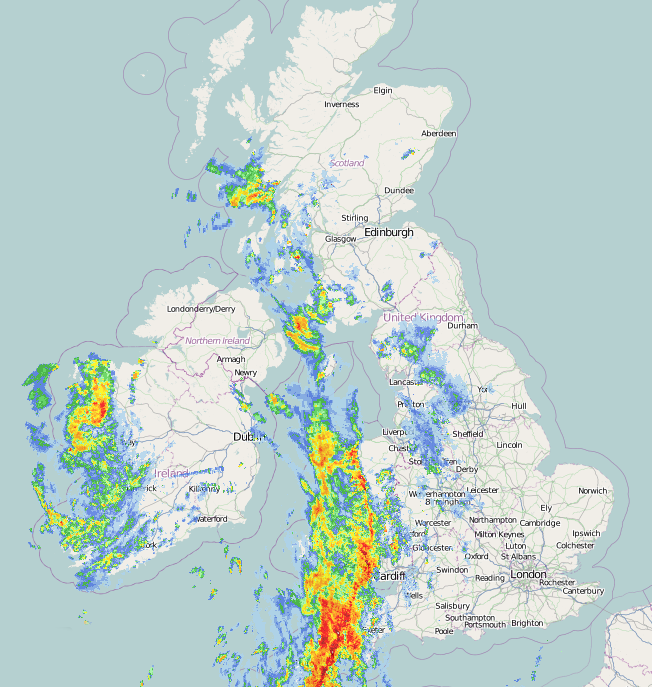

# Workflow managers

Moving from applications to pipelines

<div style="height: 1px;"></div>

**Pipelines:**
- A series of data processing steps
- Each step may require different tools
- How do we manage these steps and their dependencies in a reproducible, scalable  and efficient way?

<div style="height: 20px;"></div>

::left::

<v-click>

**Pipeline development:**
- Prototype: By hand
- Automate: Scripts (rigid)
- Scale-up: Workflow managers

</v-click>

::right::

<v-click>

**Scaling:**
- Horizontal: Increased data volume
- Vertical: More complex analyses with different pathways

</v-click>

---

# Workflow managers

<div style="height: 1px;"></div>

::centralise

**Fundamentals:**
- Reproducible data analyses
- Complex workflows (manage hundreds of steps, dependencies)
- Cheap parallelisation (on local machine, that can be easily extended to clusters/cloud)
- Selective rebuilds (only re-run what is necessary, can be sensitive to _data_ changes and _code_ changes)

---

# Workflow managers

<div style="height: 1px;"></div>

::centralise

Popular workflow managers:
- **Snakemake** – Make-style workflows tied to file inputs/outputs
- **Nextflow** – Parallel scientific workflows with strong container and cluster support
- **Apache Airflow** – Enterprise task orchestration for data engineering pipelines
- **Prefect** – Modern dynamic workflows with an emphasis on monitoring and easy config
- **Luigi** – Lightweight local pipelines built around explicit task dependencies

---

<div class="flex justify-center">
  
</div>

<div style="height: 20px;"></div>

A tool to create **reproducible** and **scalable data analyses**.

Workflows are described via a **human readable**, **Python-based** language.

They can be **seamlessly scaled** to server, cluster, grid and cloud environments, without the need to modify the workflow definition.

Workflows can entail a **description of required software**, which will be automatically deployed to any execution environment.

---

<div class="flex justify-center">
  
</div>

<div style="height: 20px;"></div>

**Build system** inspired by **make**

A build system is a tool that constructs a **target** from available files / data, given a set of **rules**

Instead of a **Makefile** to define those rules we use a **Snakefile**

---

<div class="flex items-center justify-center h-full">
  
</div>

---
transition: none
---

<div style="height: 20px;"></div>

<div class="relative h-100% w-100%">

  <div class="absolute top-0 right-1/2 -translate-x-20 w-50 border border-gray-400 px-3 py-1 rounded shadow">
    Download weather station data
  </div>

  <svg class="absolute inset-0 w-full h-full pointer-events-none">
    <line x1="250" y1="64" x2="300" y2="115" stroke="gray-400" stroke-width="1" />
  </svg>

  <div class="absolute top-0 left-1/2 w-50 border border-gray-400 px-3 py-1 rounded shadow">
    Geographic Information System
  </div>

  <svg class="absolute inset-0 w-full h-full pointer-events-none">
    <line x1="540" y1="64" x2="300" y2="115" stroke="gray-400" stroke-width="1" />
  </svg>

  <svg class="absolute inset-0 w-full h-full pointer-events-none">
    <line x1="540" y1="64" x2="505" y2="115" stroke="gray-400" stroke-width="1" />
  </svg>

  <div class="absolute top-29 right-1/2 -translate-x-10 border border-gray-400 px-3 py-1 rounded shadow">
    Precipitation Forecast
  </div>

  <svg class="absolute inset-0 w-full h-full pointer-events-none">
    <line x1="300" y1="152" x2="440" y2="200" stroke="gray-400" stroke-width="1" />
  </svg>

  <svg class="absolute inset-0 w-full h-full pointer-events-none">
    <line x1="505" y1="152" x2="440" y2="200" stroke="gray-400" stroke-width="1" />
  </svg>

  <div class="absolute top-29 left-1/2 -translate-x--10 border border-gray-400 px-3 py-1 rounded shadow">
    Map
  </div>

  <div class="absolute top-50 left-1/2 -translate-x-1/2 inline-block border border-gray-400 px-3 py-1 rounded shadow">
    Visualise
  </div>

  <div class="absolute top-60 left-1/2 -translate-x-1/2 inline-block border border-gray-400 px-3 py-1 rounded shadow">
    
  </div>

</div>

---

<div style="height: 20px;"></div>

<div class="relative h-100% w-100%">

  <div class="absolute top-0 right-1/2 -translate-x-20 w-50 border border-gray-100 text-gray-400 px-3 py-1 rounded shadow">
    Download weather station data
  </div>

  <svg class="absolute inset-0 w-full h-full pointer-events-none">
    <line x1="250" y1="64" x2="300" y2="115" stroke="gray-100" stroke-width="1" />
  </svg>

  <div class="absolute top-0 left-1/2 w-50 border border-gray-100 text-gray-400 px-3 py-1 rounded shadow">
    Geographic Information System
  </div>

  <svg class="absolute inset-0 w-full h-full pointer-events-none">
    <line x1="540" y1="64" x2="300" y2="115" stroke="gray-100" stroke-width="1" />
  </svg>

  <svg class="absolute inset-0 w-full h-full pointer-events-none">
    <line x1="540" y1="64" x2="505" y2="115" stroke="gray-100" stroke-width="1" />
  </svg>

  <div class="absolute top-29 right-1/2 -translate-x-10 border border-gray-100 text-gray-400 px-3 py-1 rounded shadow">
    Precipitation Forecast
  </div>

  <svg class="absolute inset-0 w-full h-full pointer-events-none">
    <line x1="300" y1="152" x2="440" y2="200" stroke="gray-100" stroke-width="1" />
  </svg>

  <svg class="absolute inset-0 w-full h-full pointer-events-none">
    <line x1="505" y1="152" x2="440" y2="200" stroke="gray-100" stroke-width="1" />
  </svg>

  <div class="absolute top-29 left-1/2 -translate-x--10 border border-gray-100 text-gray-400 px-3 py-1 rounded shadow">
    Map
  </div>

  <div class="absolute top-50 left-1/2 -translate-x-1/2 inline-block border border-gray-400 px-3 py-1 rounded shadow">
    Visualise
  </div>

  <div class="absolute top-60 left-1/2 -translate-x-1/2 inline-block border border-gray-400 px-3 py-1 rounded shadow">
    
  </div>

</div>

---
transition: none
---

```
overlay_on_map.sh \
    model/forecast_model.dat maps/uk.map \
    --output results/UK.png
```

---
transition: none
---

<pre class="slidev-code shiki"><code>overlay_on_map.sh \
    <span style="font-weight: bold; color: #0e8a16;">model/forecast_model.dat</span> <span style="font-weight: bold; color: #1d76db;">maps/uk.map</span> \
    --output <span style="font-weight: bold; color: #d93f0b;">results/UK.png</span></code></pre>

<div style="height: 4px;"></div>

<v-click>
<pre class="slidev-code shiki"><code>rule visualise:
    input:
        <span style="font-weight: bold; color: #0e8a16;">forecast = "model/forecast_model.dat",</span>
        <span style="font-weight: bold; color: #1d76db;">map = "maps/UK.map",</span>
    output:
        <span style="font-weight: bold; color: #d93f0b;">"results/UK.png"</span>
    shell:
        """
        overlay_on_map.sh <span style="font-weight: bold; color: #0e8a16;">{input.forecast}</span> <span style="font-weight: bold; color: #1d76db;">{input.map}</span> -output <span style="font-weight: bold; color: #d93f0b;">{output}</span>
        """
</code></pre>
</v-click>

---

Updates to data (*or scripts*) trigger **selective** rebuilds

---
transition: none
---

<div style="height: 20px;"></div>

<div class="relative h-100% w-100%">

  <div class="absolute top-0 right-1/2 -translate-x-20 w-50 border border-blue-400 text-blue px-3 py-1 rounded shadow">
    Download weather station data
  </div>

  <svg class="absolute inset-0 w-full h-full pointer-events-none">
    <line x1="250" y1="64" x2="300" y2="115" stroke="gray-100" stroke-width="1" />
  </svg>

  <div class="absolute top-0 left-1/2 w-50 border border-gray-100 text-gray-400 px-3 py-1 rounded shadow">
    Geographic Information System
  </div>

  <svg class="absolute inset-0 w-full h-full pointer-events-none">
    <line x1="540" y1="64" x2="300" y2="115" stroke="gray-100" stroke-width="1" />
  </svg>

  <svg class="absolute inset-0 w-full h-full pointer-events-none">
    <line x1="540" y1="64" x2="505" y2="115" stroke="gray-100" stroke-width="1" />
  </svg>

  <div class="absolute top-29 right-1/2 -translate-x-10 border border-gray-100 text-gray-400 px-3 py-1 rounded shadow">
    Precipitation Forecast
  </div>

  <v-click>
    <div class="absolute top-30 left-40 text-red-600" style="transform: rotate(-15deg);">
      OUT-OF-DATE
    </div>
  </v-click>

  <svg class="absolute inset-0 w-full h-full pointer-events-none">
    <line x1="300" y1="152" x2="440" y2="200" stroke="gray-100" stroke-width="1" />
  </svg>

  <svg class="absolute inset-0 w-full h-full pointer-events-none">
    <line x1="505" y1="152" x2="440" y2="200" stroke="gray-100" stroke-width="1" />
  </svg>

  <div class="absolute top-29 left-1/2 -translate-x--10 border border-gray-100 text-gray-400 px-3 py-1 rounded shadow">
    Map
  </div>

  <div class="absolute top-50 left-1/2 -translate-x-1/2 inline-block border border-gray-100 text-gray-400 px-3 py-1 rounded shadow">
    Visualise
  </div>

  <v-click>
    <div class="absolute top-51 left-88 text-red-600" style="transform: rotate(-15deg);">
      OUT-OF-DATE
    </div>
  </v-click>

  <div class="absolute top-60 left-1/2 -translate-x-1/2 inline-block border border-gray-400 px-3 py-1 rounded shadow">
    
  </div>

</div>

---

<div style="height: 20px;"></div>

<div class="relative h-100% w-100%">

  <div class="absolute top-0 right-1/2 -translate-x-20 w-50 border border-gray-400 px-3 py-1 rounded shadow">
    Download weather station data
  </div>

  <svg class="absolute inset-0 w-full h-full pointer-events-none">
    <line x1="250" y1="64" x2="300" y2="115" stroke="gray-400" stroke-width="1" />
  </svg>

  <div class="absolute top-0 left-1/2 w-50 border border-gray-100 text-gray-400 px-3 py-1 rounded shadow">
    Geographic Information System
  </div>

  <svg class="absolute inset-0 w-full h-full pointer-events-none">
    <line x1="540" y1="64" x2="300" y2="115" stroke="gray-100" stroke-width="1" />
  </svg>

  <svg class="absolute inset-0 w-full h-full pointer-events-none">
    <line x1="540" y1="64" x2="505" y2="115" stroke="gray-100" stroke-width="1" />
  </svg>

  <div class="absolute top-29 right-1/2 -translate-x-10 border border-gray-400 px-3 py-1 rounded shadow">
    Precipitation Forecast
  </div>

  <svg class="absolute inset-0 w-full h-full pointer-events-none">
    <line x1="300" y1="152" x2="440" y2="200" stroke="gray-400" stroke-width="1" />
  </svg>

  <svg class="absolute inset-0 w-full h-full pointer-events-none">
    <line x1="505" y1="152" x2="440" y2="200" stroke="gray-100" stroke-width="1" />
  </svg>

  <div class="absolute top-29 left-1/2 -translate-x--10 border border-gray-100 text-gray-400 px-3 py-1 rounded shadow">
    Map
  </div>

  <div class="absolute top-50 left-1/2 -translate-x-1/2 inline-block border border-gray-400 px-3 py-1 rounded shadow">
    Visualise
  </div>

  <div class="absolute top-60 left-1/2 -translate-x-1/2 inline-block border border-gray-400 px-3 py-1 rounded shadow">
    
  </div>

</div>

---
transition: none
---

# Extensible / scalable pipelines
Counties (48): Beds, Berks, Bucks, Cambs, Ches, Corn, Cumb, ...

---
transition: none
---

# Extensible / scalable pipelines
Counties (48): Beds, Berks, Bucks, Cambs, Ches, Corn, Cumb, ...

<div style="height: 20px;"></div>

<pre class="slidev-code shiki"><code>rule visualise:
    input:
        forecast = “model/forecast_model.dat”,
        map = “maps/<span style="font-weight: bold; color: #d93f0b;">UK</span>.map”
    output:
        “results/<span style="font-weight: bold; color: #d93f0b;">UK</span>.png”
    shell:
        “overlay_on_map.sh {input.forecast} {input.map} -output {output}”
</code></pre>

---
transition: none
---

# Extensible / scalable pipelines
Counties (48): Beds, Berks, Bucks, Cambs, Ches, Corn, Cumb, ...

<div style="height: 20px;"></div>

<pre class="slidev-code shiki"><code>rule visualise:
    input:
        forecast = “model/forecast_model.dat”,
        map = “maps/<span style="font-weight: bold; color: #d93f0b;">{county}</span>.map”
    output:
        “results/<span style="font-weight: bold; color: #d93f0b;">{county}</span>.png”
    shell:
        “overlay_on_map.sh {input.forecast} {input.map} -output {output}”
</code></pre>

<div style="height: 20px;"></div>

In Snakemake we can use curly braces `{}` to denote wildcards

<v-click>
But, this rule no longer defines a <span style="font-weight: bold">build target</span>!
</v-click>

---
transition: none
---

# Extensible / scalable pipelines
Counties (48): Beds, Berks, Bucks, Cambs, Ches, Corn, Cumb, ...

<div style="height: 20px;"></div>

```{1-7}
rule all:
    input:
        "results/Beds.png”,
        "results/Berks.png”,
        "results/Bucks.png”,
        "results/Cambs.png”,
        "results/Ches.png”,

rule visualise:
    input:
        forecast = “model/forecast_model.dat”,
        map = “maps/{county}.map”
    output:
        “results/{county}.png”
    shell:
        “overlay_on_map.sh {input.forecast} {input.map} -output {output}”
```

By default, Snakemake will attempt to satisfy the first rule in a Snakefile which, by convention, we name 'all' since it collects the build targets.

---

# Extensible / scalable pipelines
Counties (48): Beds, Berks, Bucks, Cambs, Ches, Corn, Cumb, ...

<div style="height: 20px;"></div>

```{1-5}
counties = [‘Beds’, ‘Berks’, ‘Bucks’, ‘Cambs’, ‘Ches’]

rule uk_map:
    input:
        expand(“results/{county}.png”, county=counties)

rule visualise:
    input:
        forecast = “model/forecast_model.dat”,
        map = “maps/{county}.map”
    output:
        “results/{county}.png”
    shell:
        “overlay_on_map.sh {input.forecast} {input.map} -output {output}”
```

We can simplify this slightly by making using of Python and helper functions, such as `expand()` (note that the curly braces in `expand()` are unrelated arguments to the function, not wildcards).

---


```
counties = [‘Beds’, ‘Berks’, ‘Bucks’, ‘Cambs’, ‘Ches’]

rule uk_map:
    input:
        expand(“results/{county}.png”, county=counties)

rule visualise:
    input:
        forecast = “model/forecast_model.dat”,
        map = “maps/{county}.map”
    output:
        “results/{county}.png”
    shell:
        “overlay_on_map.sh {input.forecast} {input.map} -output {output}”
```

---

# Snakemake

::centralise

Decompose workflows into rules

Uses Python (and some domain specific syntax)

Rules define how to obtain output files from input files

Snakemake infers dependencies and execution order of rules

Execution:
- `shell` directive allow you to execute scripts from any language, e.g. python, R, julia, rust, …
- `run` directive allows you to execute python code natively

---
layout: two-cols-header
---

# Directed Acyclic Graph (DAG)

::left::

<div style="height: 60px;"></div>


::right::

<div style="height: 40px;"></div>

Scheduling heuristic is applied to
- Maximise parallelization
- Prefer high priority jobs
- Subject to resource constraints

Disjoint paths in DAG can be executed in parallel

`snakemake –-cores 8`

---

# Useful features

::centralise

- Run each rule in its own virtual environment (e.g. `conda` directive)
- Lint workflow (`snakemake --lint`)
- Modularise workflow (and reuse) (`module` directive)
- Build DAG tree (`snakemake --d3dag`)
- Visualise DAG (Dot from graphviz: `snakemake –-dag targets | dot -Tpng > dag.png`)
- Support for temporary and protected files
- Tracking of tool versions and code changes
- A Python API for embedding Snakemake in other tools

---


