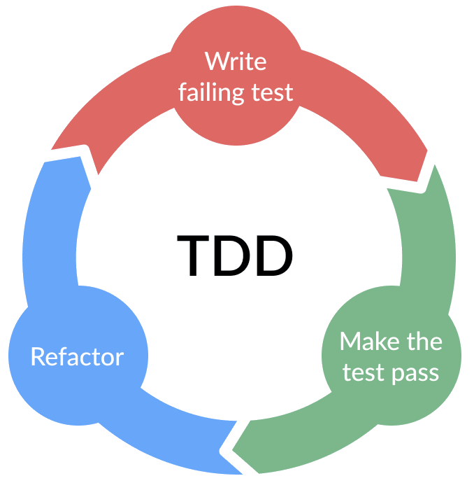

---
layout: two-cols
---

# Mars Climate Orbiter (1999)

<v-clicks>

- The orbiter was lost due to a simple unit conversion error
  between metric and imperial units in navigation software
- NASA lost roughly <span class="font-semibold text-red-700">$125 million</span>
- Communication was lost as the spacecraft entered orbit
- The root cause was a software error that should have been caught earlier
- No proper checks and tests were carried out on the responsible code

</v-clicks>

::right::

<div class="h-full flex items-center justify-center pl-4">
  
</div>

---
layout: two-cols
---

# Knight Capital (2012)

<v-clicks>

- A deployment glitch in Knight Capital's trading system caused major losses
- Roughly <span class="font-semibold text-red-700">$440 million</span> disappeared in 30 minutes
- New code was deployed just before the system went live
- One server still ran old code and produced incorrect stock purchase orders
- Small rollout mistakes can become catastrophic when software acts at scale

</v-clicks>

::right::

<div class="h-full flex items-center justify-center pl-4">
  
</div>

---

# Maintaining Legacy Code

<v-clicks>

- Difficult to modify without breaking existing behaviour
- We often add tests first so we can preserve behaviour while changing code
- Bugs become much more expensive to fix later in the software lifecycle
- One Microsoft study estimated 10-20 defects per 1000 lines of code
- Approximate cost to fix: 1-10-150 hours in design, development, and production

</v-clicks>

---

# Importance of Software Testing

<v-clicks>

- Demonstrating that software produces the right results is critical
- Even if each line of code looks correct, errors can accumulate across a program
- Key questions to ask:
  - Does the software work as expected?
  - Can the correctness be verified independently?
  - How confident are we in the accuracy of the results?
- If we cannot answer those questions, using the software is hard to justify

</v-clicks>

---

# The Role of Automation in Software Testing

<v-clicks>

- Manual testing is <span class="font-semibold">necessary</span>
- However, manual checking is prone to error
- It can also be slow and expensive
- Automated testing means writing code that checks your software for you
- Computers are excellent at repetitive, repeatable tasks
- Automated tests reduce effort in the long run
- Automated testing should supplement manual testing, not replace it entirely

</v-clicks>

---
layout: two-cols
---

# Automated Testing

<v-clicks>

- **Unit tests**: check specific units of functionality for expected outputs
- **Functional / integration tests**: exercise code paths across components
- **Regression tests**: confirm that program output stays unchanged after modifications
- This course focuses on unit testing, but the same principles generalise well
- In Python, `pytest` is a popular and robust testing framework

</v-clicks>

::right::

```python
def test_reversed():
    assert list(reversed([1, 2, 3])) == [3, 2, 1]
```

---
layout: two-cols
---

# Popular Frameworks for Other Languages

<v-clicks>

- Java: `JUnit`
- Fortran: `FRUIT`
- JavaScript: `Jest`
- C++: `Catch2`
- Rust: built-in test library
- Python: `pytest`
  - `unittest` is also built in

</v-clicks>

::right::

<div class="grid grid-cols-2 gap-4 place-items-center pt-6">
  
  
  
  
</div>

---
layout: two-cols
---

# Test-Driven Development

<v-clicks>

- Start by writing a failing test
- Write the smallest amount of code needed to make it pass
- Refactor once behaviour is protected by tests
- Repeat in short cycles

</v-clicks>

::right::

<div class="h-full flex items-center justify-center">
  
</div>

---

# Digging Deeper into Errors with Debugging

<v-clicks>

- Unit tests can detect problems and narrow down where to look
- They usually do not explain the exact internal cause
- Useful techniques include:
  - Printing program state at key points
  - Using logging to trace execution
  - Examining intermediate files and outputs
- When that is not enough, a debugger lets you inspect running code in detail

</v-clicks>

---
layout: two-cols-header
---

# Other Useful Techniques

::left::

### Defensive Programming

<v-clicks>

- Check that input data satisfies preconditions before continuing
- Raise an error when assumptions are violated instead of silently continuing
- In Python, type and shape checks are often especially useful

</v-clicks>

::right::

### Code Quality Checks

<v-clicks>

- Linters detect errors, inconsistencies, and style issues automatically
- They improve readability, maintainability, and consistency
- Code smells can signal deeper design issues even when code still runs
- Examples: oversized classes, long parameter lists, duplicated branches

</v-clicks>

---

# Limits to Testing

<v-clicks>

- Testing effort should match the software's complexity and importance
- Automated testing becomes more valuable as systems grow
- Even strong unit test suites cannot catch every bug
- Manual exploration and realistic data testing still matter
- Tests do not guarantee bug-free software, but they reduce risk significantly

</v-clicks>

