## Part 1: What problems does version control solve?

---

# "I lost my code"

## Problem: single-point of failure

- Work often lives on one laptop or desktop
- Accidental deletion, disk failure, theft, ...
- Backups are often manual, incomplete, or forgotten

 

## Underlying issue?

- No systematic record of how files changed over time
- No reliable workflow for off-site backup

---
layout: two-cols
---

# "Final_v7_REAL_FINAL.py"

## Problem: uncontrolled versions
- Files duplicated and renamed to track changes
- No clear record of why a change was made
- Hard to tell which version produced which result

 

## Underlying issue?
- Versions are tracked by filenames instead of history
- Changes lack structure and explanation

::right::

::center
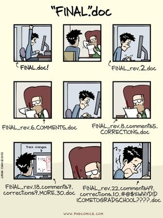
::

---

# "I can’t reproduce my results"

## Problem: lost historical context
- Code evolves during analysis or development
- Results depend on specific versions of scripts
- Older versions are overwritten or missing

 

## Underlying issue?
- No way to recover or inspect earlier states of the project
- No link between results and the code that produced them

---

# "Can you email me your code?"

## Problem: ad-hoc collaboration
- Files sent as email attachments or chat uploads
- Multiple people editing in parallel
- Changes overwrite each other or conflict silently

 

## Underlying issue?
- No shared, coordinated way to combine independent work
- No visibility into who changed what, and when

---

# A shared root cause

## All of these problems stem from the same issue:
- No structured history of changes
- No safe way to explore, undo, or combine work
- No shared understanding of the project’s evolution

 
 
 

<v-click>

  <h3><b>Version control exists to solve these problems systematically</b></h3>

</v-click>

---
layout: two-cols
---

# What is version control?

- A tool that tracks changes to files
- Particularly useful for raw text files like code, config and tests in software
- Records the changes you made, and the order in which you made them
- Akin to Wikipedia page history or 'Track Changes' in Word, but for plain text files

::right::

 
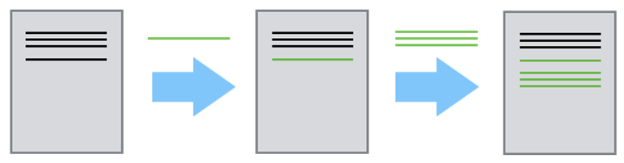
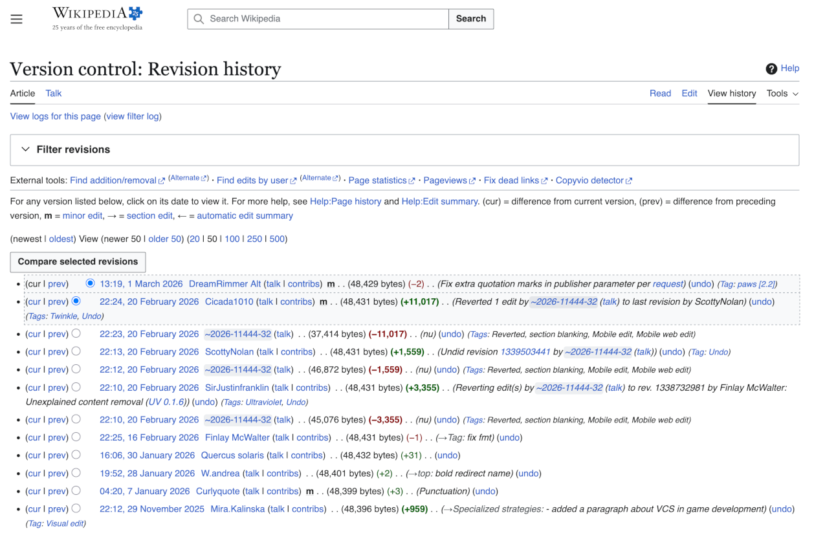

---

# Why use version control: backup

- Keeps an automatic, complete history of your work
- Protects against accidental loss or mistakes
- Enables recovery of any earlier project state
- Typically includes secure off-machine copies, protecting against local failures

---
layout: two-cols
---

# Why use version control: reproducibility

- Access to a copy of every version of the code
- Easy to replicate results from any paper
- Easy to share full copy of any version
- 'Tagging' your key versions v1, v2...

::right::

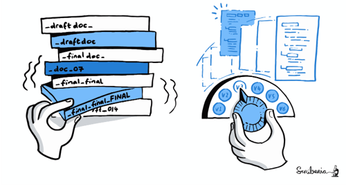

---
layout: two-cols
---

# Why use version control: collaboration

- Easy to build on others’ changes
- Share one version with collaborators whilst you work on another
- Collaborative development without stepping on each other’s toes

::right::

::center
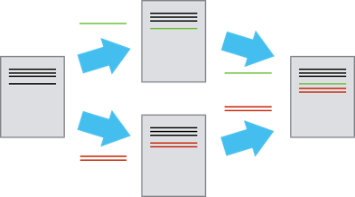
::

---
layout: section
title: " "
---

## Part 2: How version control works (conceptually)

---

# How do version control tools work?

- Start by storing the original base version of the file
- After that, only changes are stored
- Like instructions for building LEGO

 
 

  

---
layout: two-cols
---

# How do version control tools work?

- Changes are separate from the project files themselves
- Two contributors can make independent sets of changes
- Creates two different versions of the document

::right::

::center
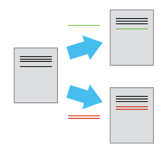
::

---
layout: two-cols
---

# How do version control tools work?

  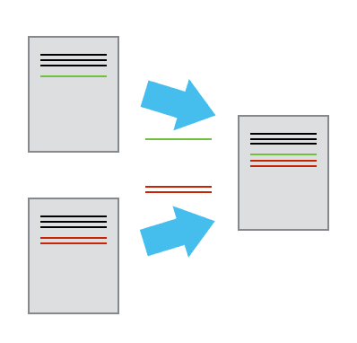

::right::

- If no conflicts – combine changes (often called merging)
- Two conflicting sets of changes can be manually combined

---

# What should go in version control

- The full project structure (directories and subdirectories)
- Source materials: code, configuration, documentation, and test data
- Text-based files, where changes can be tracked clearly
- Code organised into smaller, logical files to make changes easier to follow

---

# What should not go in version control

- Generated output files or compiled binaries
- Large data files that are produced by running the code
- **Sensitive or confidential information (e.g. passwords, keys, personal data)**

---
layout: section
title: " "
---

## Part 3: Specific tooling

---
layout: two-cols
---

# Version control systems (tools)

- Git
  - Overwhelmingly most popular
- Mercurial
- Subversion (SVN)

::right::

  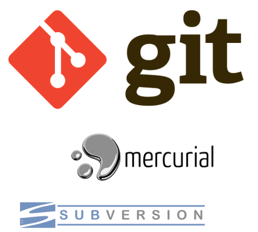

---
layout: two-cols
---

# Version control platforms

- Upload version-controlled files to a remote server

  
  

- Collaborate with anyone, anywhere in the world
- Share your code openly (or not!)
- Storing remotely protects you from disaster
  - fire, theft, technical faults

::right::

  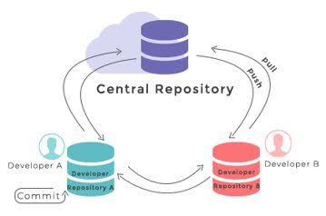
  

---
layout: two-cols
---

# Version control workflows

- Different groups may have different ways of working with version control
- A workflow is agreed-upon best practices for collaboration
- Required to share code you’re working on with existing projects

::right::

::center
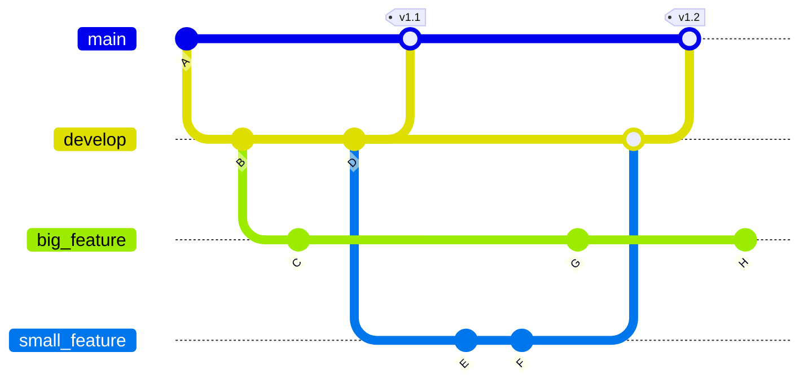
::

---

# How do you use version control?

- Command-line interface (CLI) for git
- Same on every platform (Mac, Windows & Linux)
- CLI will be necessary for high-performance cluster (HPC) work

---
layout: two-cols
---

# How do you use version control?

- Standalone graphical user interfaces
  - GitHub Desktop
  - Git Kraken
  - Sourcetree
- Built into most IDEs
  - VSCode
  - Rstudio
  - PyCharm

::right::

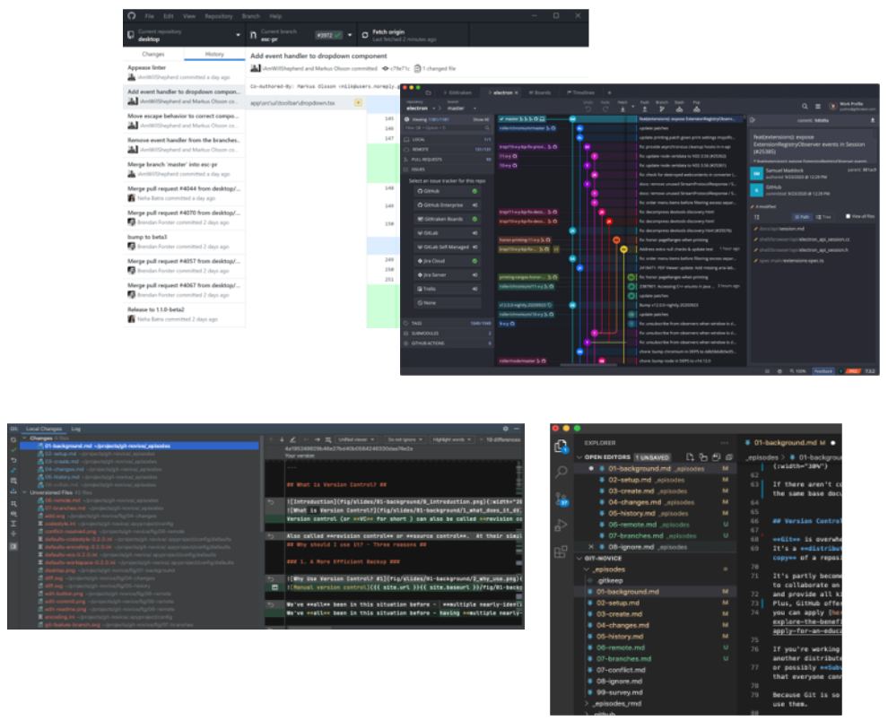

---

# How do you use version control platforms?

- 'Authenticate' your computer by generating an SSH key pair
  - One 'private' that never leaves your computer
  - One 'public'
- Anyone who has the public key can verify you own the private key using cryptography *without having to see it*
- Upload the public one to GitHub (or GitLab) as 'authentication'
- Now you can securely transfer code!

---

# Learning objectives

- Learn how version control systems work
- Configure Git and GitHub
- Create or clone repositories
- Learn the modify-add-commit cycle
- Compare files with previous versions
- Manage branches and resolve merge conflicts
- Exclude certain files from version control
