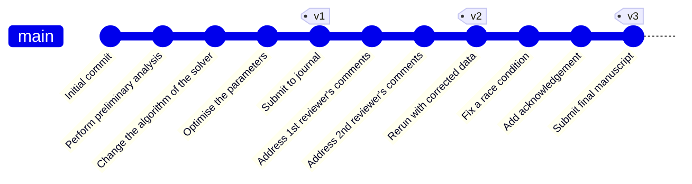
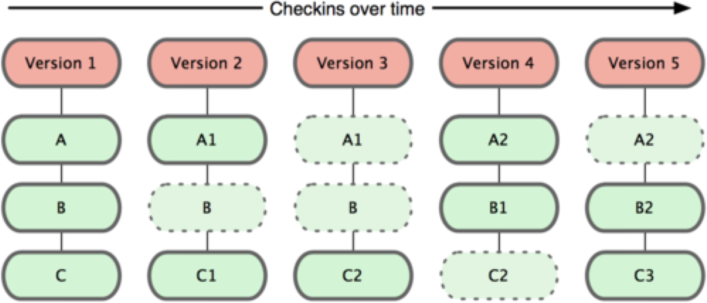
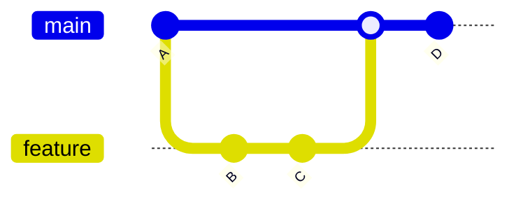
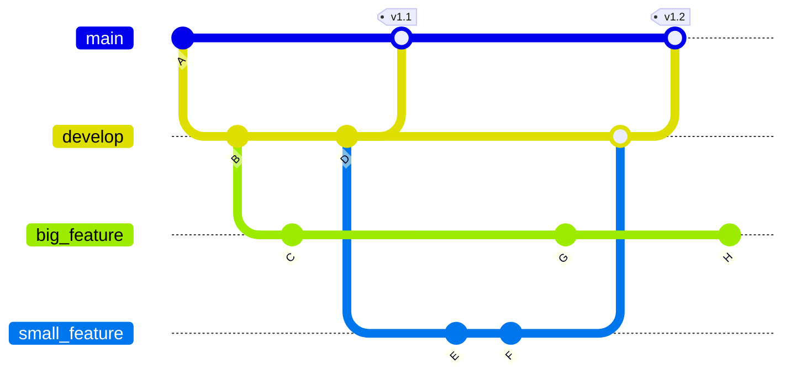

## Part 1: What is version control?

---
layout: two-cols
---

# What is version control?

- A tool that tracks changes to files
- Particularly useful for plain text files like code, configuration, documentation, and tests
- Records the changes you made, and the order in which you made them
- Akin to Wikipedia page history or 'Track Changes' in Word, but for plain text files

::right::

<div style="display: flex; flex-direction: column; align-items: center; gap: 20px;">
<br />


</div>

---
layout: section
title: " "
---

## Part 2: Why is version control essential to code development?

---

# "I lost my code"

## Problem: single point of failure

- Work often lives on one laptop or desktop
- Accidental deletion, disk failure, theft, ...
- Backups are often manual, incomplete, or forgotten

<br />

## Underlying issue?

- No systematic record of how files changed over time
- No reliable workflow for off-site backup

---
layout: two-cols
---

# "Final_v7_REAL_FINAL.py"

## Problem: uncontrolled versions
- Files duplicated and renamed to track changes
- No clear record of why a change was made
- Hard to tell which version produced which result

<br />

## Underlying issue?
- Versions are tracked by filenames instead of history
- Changes lack structure and explanation

::right::

::center

::

---

# "I can’t reproduce my results"

## Problem: lost historical context
- Code evolves during analysis or development
- Results depend on specific versions of scripts
- Older versions are overwritten or missing

<br />

## Underlying issue?
- No way to recover or inspect earlier states of the project
- No link between results and the code that produced them

---

# "Can you email me your code?"

## Problem: ad-hoc collaboration
- Files sent as email attachments or chat uploads
- Multiple people editing in parallel
- Changes overwrite each other or conflict silently

<br />

## Underlying issue?
- No shared, coordinated way to combine independent work
- No visibility into who changed what, and when

---

# A shared root cause

## All of these problems stem from the same issue:
- No structured history of changes
- No safe way to explore, undo, or combine work
- No shared understanding of the project’s evolution

<br />
<br />
<br />

<v-click>

<div style="text-align: center;">
  <h3><b>Version control exists to solve these problems systematically</b></h3>
</div>

</v-click>

---

# Version control gives you: backup

- Keeps an automatic, complete history of your work
- Protects against accidental loss or mistakes
- Enables recovery of any earlier project state
- Protects against local failures with secure and remote off-machine copies

<br />

> These solve the *"I lost my code"* problem.

---

# Version control gives you: reproducibility

- Every version of the code is preserved
- Easy to replicate results from any paper
- Easy to share a full copy of any version
- 'Tagging' your key versions v1, v2...

<br />

> These solve the *"I can't reproduce my results"* and *"Final_v7_REAL_FINAL.py"* problems.

<br />



---
layout: two-cols
---

# Version control gives you: frictionless collaboration

- Easy to build on others’ changes
- Share one version with collaborators whilst you work on another
- Independent edits can be combined automatically
- Conflicting changes can be handled safely rather than silently overwritten

<br />

> These solve the *"Can you email me your code?"* problem.

::right::

::center

::

---
layout: section
title: " "
---

## Part 3: Tooling for version control

---
layout: two-cols
---

# How we got here

- **1973**: SCCS --- inline annotations, delta encoding
- **1982**: RCS --- tracks one file at a time, stored as reverse deltas
- **1986**: CVS --- concurrent edits over a central server, repository-level history
- **2000**: Subversion (SVN) --- **centralised**, better atomic commit handling
- **2005**: Git and Mercurial --- **distributed**, every clone is a full copy
- **Today**: Git is overwhelmingly popular; Mercurial is becoming a legacy.
- Emerging: Jujutsu --- Git-compatible, promises a cleaner workflow (2023).

::right::

<div style="display: flex; flex-direction: column; align-items: center; gap: 20px;">
  
</div>

---

# Why Git became the de facto standard

- **Distributed**
  - Every clone is a full copy with the whole history (Mercurial as well).
  - No single point of failure (SVN and other centralised systems need a central server).
- **Fast branching**
  - Branches are pointers, not copies (similar to Mercurial).
- **Built for huge collaboration**
  - Created by Linus Torvalds to manage the development of Linux kernel.
  - Intended to be used by thousands of contributors.
- **GitHub**
  - Launched in 2008.
  - Turned Git from a local CLI tool into a network with web interface.
- **Massive ecosystem**
  - Most IDEs support Git.

---

# Git stores snapshots, not deltas

- Each commit is a **snapshot** of every file in your project at that moment.
- Identical files across commits are stored only once (content-addressed by hash).

<br />
<br />
<br />

<div style="display: flex; flex-direction: column; align-items: center; gap: 20px;">
  
</div>

---

# Repository = project + its history

- A Git **repository** is a project directory with a hidden `.git/` subdirectory.
- Cloning a repository copies everything (files and full history) to your machine.
- `.git/` contains the full snapshot history of every tracked file, plus configuration.
  - You will most likely not need to worry about what are inside!

```console
[user@workstation .git]$ ls -F1
config
description
FETCH_HEAD
HEAD
hooks/
index
info/
logs/
objects/
ORIG_HEAD
packed-refs
refs/
```

---
layout: two-cols-header
---

# What belongs in a repository

::left::

**Yes:**
- The full project structure (directories and subdirectories)
- Source materials: code, configuration, documentation, and small test data
- Plain-text files, where line-by-line changes can be tracked clearly

::right::

**No:**
- Generated output files or large data files produced by running the code
- Compiled binaries
- Packages/environments (`node_modules/`, `.venv/`, `__pycache__/`)
- IDE/OS files (`.idea/`, `.DS_Store`, `.vscode/`)
- Build artefacts (`dist/`, `build/`)
- **Sensitive or confidential information (e.g. passwords, keys, personal data)**

<br />

A `.gitignore` file lists patterns to be excluded.

---
layout: two-cols
---

# Commits, diffs, log

- A **commit** is a labelled snapshot. It records:
  - what was changed
  - who changed it
  - the time of the change
  - a short message saying *why*
- `git log` contains all the history.
  - every commit, in order, with its message
- `git diff` shows the line-by-line difference between two states.
  - working tree vs last commit
  - any two commits

<br />

> *"I can't reproduce my results"*: any previous state can be recovered.

::right::

```text
commit 5dne831e867d5a4f1a83750ad82fd46041ac58e5
Author: Santa Claus <santa.claus@christmas.com>
Date:   Fri Dec 25 12:34:56 2026 +0000

    Switch to pathlib's exists for consistency
```

<br />

```diff
diff --git a/analysis.py b/analysis.py
index 9zkc721..5dne831 100829
--- a/analysis.py
+++ b/analysis.py
@@ -1 +1 @@
-if os.path.exists(file_path):
+if Path(file_path).exists():
```

---
layout: two-cols
---

# Branching

- Branches are independent lines of development.
- Two contributors can make independent sets of changes on separate branches.
- Branches keep parallel work isolated until you choose to combine them.

::right::

::center

::

---
layout: two-cols
---

# Merging

- Two parallel branches can be combined back into one.
- If their changes do not conflict, the merge is automatic.
- If the same lines were edited differently, the conflict requires manual resolution.

::right::

<div style="display: flex; justify-content: center; align-items: center; gap: 20px; margin: 20px 0;">
    
</div>

---
layout: two-cols
---

# Push, pull, and what a remote is

- A **remote** is a copy of the repository hosted elsewhere (typically on GitHub or GitLab).
- `git clone` makes a new local copy of a remote repository
- `git push` uploads your new commits to the remote
- `git pull` fetches new commits from the remote and combines them with the local copy

<br />

> This is what gives you off-machine backup.

::right::

<div style="display: flex; flex-direction: column; align-items: center; gap: 20px;">
  
</div>

---

# How do you use version control?

- Command-line interface (CLI) for Git
- Same on every platform (macOS, Windows & Linux)
- CLI will be necessary when working in high-performance computing (HPC) systems

---
layout: two-cols
---

# How do you use version control?

- Standalone graphical user interfaces
  - GitHub Desktop
  - GitKraken
  - Sourcetree
- Built into most IDEs
  - VS Code
  - RStudio
  - PyCharm

::right::


---
layout: two-cols
---

# Version control platforms

- Host repositories on a remote server so we can collaborate
- Storing remotely protects you from local failure (fire, theft, hardware failure)
- Popular platforms: **GitHub**, **GitLab**
- Open-source: **Codeberg** (powered by Forgejo)
- Others: **Bitbucket**

::right::

<div style="display: flex; flex-direction: column; align-items: center;">
  
</div>

<div class="absolute bottom-16 left-12 right-12" style="display: flex; justify-content: space-evenly; align-items: center; gap: 20px;">
  
  
  
  
</div>

---

# Authenticating with a remote platform

1. **SSH key pair**
  - Generate: `ssh-keygen -t ed25519 -C "albus.dumbledore@hogwarts.com"`
  - Upload the **public** key to GitHub/GitLab.
  - Your machine proves identity with the **private** key using cryptography.
2. **GitHub CLI**
  - `gh auth login` uses OAuth and stores credentials for you.

<br />

> Password-based authentication for Git in GitHub has been removed.

---
layout: two-cols
---

# Workflows

A **workflow** is a set of agreed practices for using Git in a team.

- **GitHub Flow**
  - `main` branch plus short-lived feature branches.
- **Git Flow**
  - `main` branch and usually with a `dev` branch.
  - feature, bug-fix and release branches all branch off `dev`.
- **Trunk-based development**
  - frequent merges to the `main` branch.
  - suitable with reliable test automation.

::right::





---

# Learning objectives

- Learn how version control systems work
- Configure Git and GitHub
- Create or clone repositories
- Learn the modify-add-commit cycle
- Compare files with previous versions
- Manage branches and resolve merge conflicts
- Exclude certain files from version control
