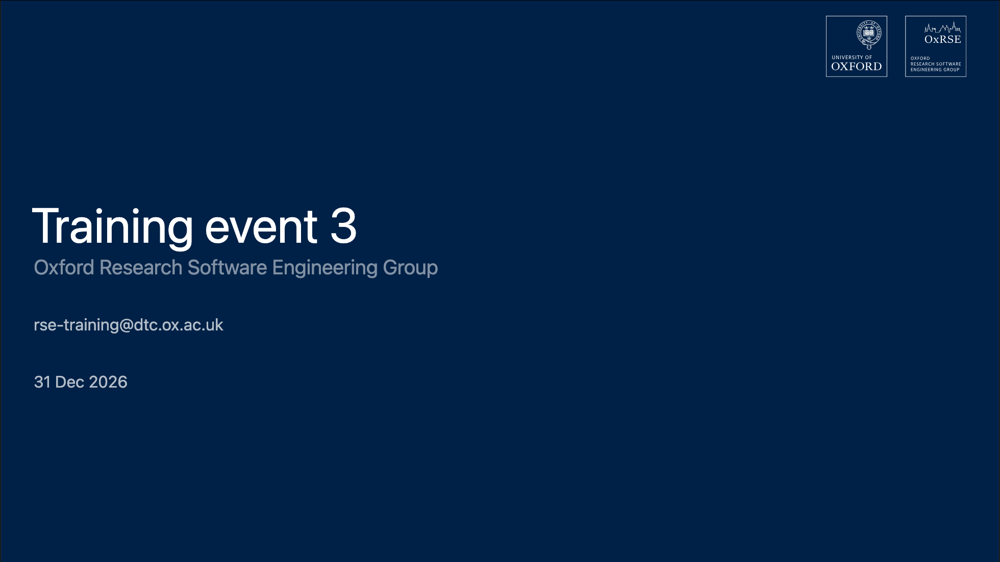
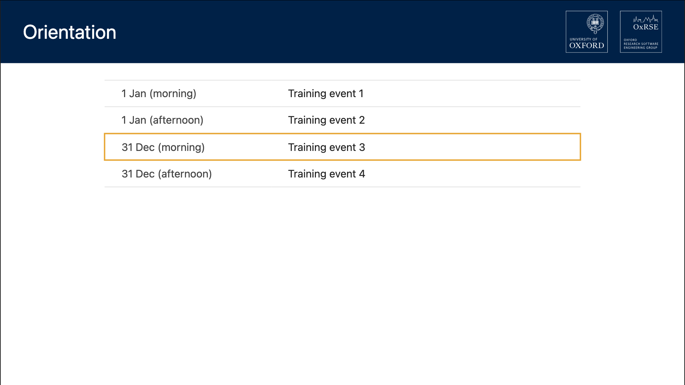
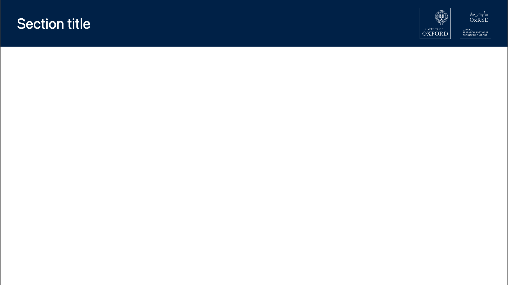
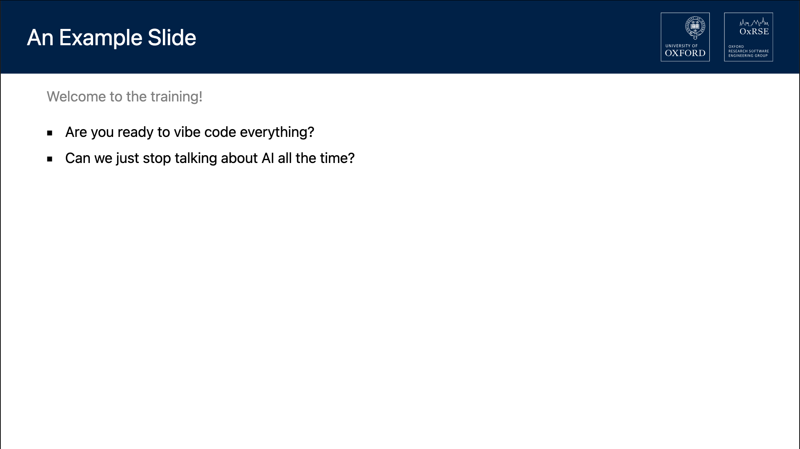

# slidev-theme-oxrse

[Slidev](https://sli.dev) theme for OxRSE training presentations.

## Install

Add the following frontmatter to `slides.md`:

```yaml
---
theme: ./theme-oxrse
---
```

Or any relative paths pointing to the theme.

## Layouts

### `cover`

Title page displaying the training event. The date can be populated from event
schedule specified by `TRAINING_EVENT` during build or as frontmatter fields.



```yaml
---
layout: cover
year: 2026
sessions:
  - date: "31 Dec"
    slot: morning
    topic: Training event 3
---
```

**Frontmatter fields:**

| Field   | Type   | Default            | Description                                  |
|---------|--------|--------------------|----------------------------------------------|
| `date` | String | auto from schedule | Override the displayed date                   |
| `year` | Number | from schedule or current year | Year used when formatting date from session lookup |
| `sessions` | Array | `null` (uses event schedule) | Inline session list for date lookup |

### `orientation`

Displays the full event schedule as a table and highlights the current
session when `highlight` matches a topic name.



```yaml
---
layout: orientation
highlight: Training Event 3
sessions:
  - date: "31 Dec"
    slot: morning
    topic: Training event 3
---
```

**Frontmatter fields:**

| Field       | Type   | Default              | Description                          |
|------------|--------|----------------------|--------------------------------------|
| `highlight`| String | `''`                 | Topic name to highlight in the table |
| `sessions` | Array  | from `TRAINING_EVENT` YAML | Inline session list to override the event schedule |

### `section`



```yaml
---
layout: section
---
# Section title
```

### Default

Standard content slide. All non-cover slides include the global header.



## Global header

It shows the title of the slide at the top left and the logos of University of
Oxford and OxRSE at the top right. This is handled by `global-top.vue`.

## Event schedule integration

Set the `TRAINING_EVENT` environment variable to load a schedule from
`common/events/<NAME>.yaml`:

```shell
TRAINING_EVENT='current-training-event' npx slidev slides.md # look for common/events/current-training-event.yaml
```

- The **cover** layout populates its date from the matching session.
- The **orientation** layout populates the full session table.

When `TRAINING_EVENT` is not set, the orientation layout shows an empty table.
You can disable it with `disabled: true` in the frontmatter.

## Development

### Regenerate screenshots

```shell
npx slidev export example.md --format png --output screenshots/layout --per-slide
```

The example presentation is [`example.md`](example.md).

## Licence

MIT &copy; 2026 OxRSE
